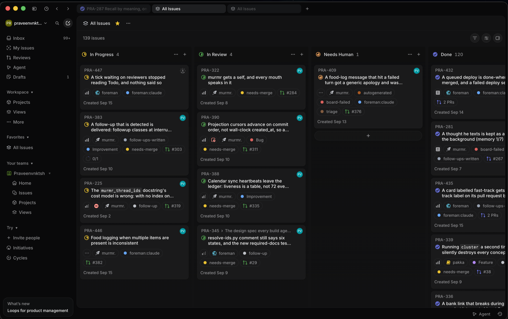
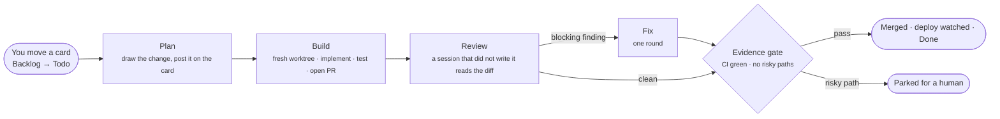
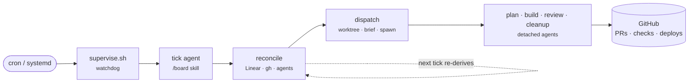

<h1 align="center">foreman</h1>

<p align="center">
  <b>Move a card to Todo. Come back to a merged pull request.</b>
</p>

<p align="center">
  <a href="https://github.com/praveenVnktsh/foreman/actions/workflows/ci.yml"></a>
  
  
  
  <a href="LICENSE"></a>
  
</p>

<p align="center">
  <b>foreman</b> is an autonomous build loop for your Linear board.<br/>
  It plans, builds, reviews and merges the cards you pick up, on your own machine, while nobody is watching.
</p>

<p align="center">
  
</p>

---

## How it works

A card you move into `Todo` is the only dispatch authorisation. Everything after
that happens without you.



Every few days a cleanup agent reads `main` and files one planned card for
the quality work that review no longer blocks on.

## Why foreman

- **You stay in charge of what gets built.** No agent can put work into `Todo`
  or take it out of `Backlog`. A failed card waits for you to re-triage it; it
  never loops.
- **Nobody reviews their own work.** The diff is reviewed by a session that did
  not write it, and the merge is gated on what GitHub holds now, never on a
  working tree.
- **It holds no state.** Each tick re-derives every card's position from Linear,
  `gh` and `git`. Kill it, restart it or upgrade it mid-build and nothing is lost.
- **It lives outside the project it builds.** A repository becomes buildable by
  adding one `board.toml`. Nothing a pull request runs ever executes on your host.

## Features

### The loop
- **Plan → Build → Review → Merge** as Linear columns, each stage a detached
  agent in its own git worktree.
- **Adversarial review** that gates on blocking findings, with one fix round.
- **Evidence-based merges**: required checks, risky paths from the diff, and
  deploy step conclusions, read from GitHub.
- **Deploy watching**, including queued deploys and a `fast-track` label copied
  from the card to the pull request.
- **Scheduled cleanup** that files one well-planned card instead of blocking merges.
- **Linear priority** orders the queue; boards take turns round-robin.

### Operating it
- **One tick, every board** — a single foreman serves all your projects,
  each board with its own concurrency limit.
- **Dispatch to whichever agent works.** A stage's model is an ordered list of
  candidates — `opencode:foundry/gpt-5.6-sol`, `claude:opus` — and the tick
  spawns the first not rate-limited, falling back across models *and* across
  CLIs. See [Models and fallback](#models-and-fallback).
- **A watchdog** (`supervise.sh`) that restarts a stuck tick and can never
  dispatch a card itself.
- **Preflight** refuses to dispatch when the machine cannot build, without
  blaming the card.
- **Release-gated updates.** A merge to `main` cuts a GitHub Release — unless
  the commit says `Release: skip` — and foreman follows the latest one.

## Quick start

You need `git`, `gh`, Python 3, a Linear API key, a Linear MCP config, and one
supported harness.

```bash
git clone https://github.com/praveenVnktsh/foreman.git ~/.foreman/install
~/.foreman/install/bin/install.sh --harness claude
~/.foreman/install/bin/install-skills.sh
install -m 600 ~/.config/linear.key ~/.foreman/linear.key
cp path/to/linear-mcp.json ~/.foreman/mcp.json
~/.foreman/install/bin/boardctl add myproject --repo ~/Developer/myproject
```

Then keep it running and up to date with systemd user timers (Linux; on macOS
use launchd or cron):

```bash
~/.foreman/install/bin/install-service.sh
~/.foreman/install/bin/install-self-update.sh
```

The clone goes at `~/.foreman/install` and nowhere else: foreman derives its
home from where the clone sits, so a clone one directory deeper puts the home
somewhere the `linear.key` and `mcp.json` above are not.

`install-skills.sh` is required: the tick runs `/board`, and the harness only
finds skills in its own skills directory. The release branch, the rate-limit
fallback and the other harnesses are covered in
[docs/INSTALLING.md](docs/INSTALLING.md).

## Models and fallback

One foreman serves every board. Each stage names its model in
`foreman.toml`, and `[fallback]` lists the models it may fall down through,
strongest first. A tier is `model` or `harness:model`, so the tick falls back
across providers *and* across CLIs:

```toml
[models]
plan = "opencode:foundry/gpt-6-astra"
build = "opencode:foundry/gpt-5.6-sol"

[fallback]
tiers = ["opencode:foundry/gpt-6-astra", "opencode:foundry/gpt-5.6-sol", "claude:opus"]

[fallback.floor]
plan = "claude:opus"          # the weakest model the plan stage may reach
```

`dispatch.sh` spawns the first tier whose model is not marked rate-limited,
never below the stage's floor. A model is marked when a spawn refuses it, or
when an agent dies mid-run on an API rate-limit error, and unmarked when the
cooldown passes. Because one tick may spawn on more than one harness, the agent
registry (`$HARNESS_SH list`) merges every harness it can use. The design is in
[docs/specs](docs/specs/).

## Make a repository buildable

Add a `board.toml` at its root. Only `[linear]`, `[checks]` and `[test]` are
needed; everything else is optional.

```toml
[linear]
team = "My Team"                  # the team NAME, not its key
project = "myproject"

[checks]
required = ["Tests"]              # job names that must pass
ci_workflow = "CI"                # the workflow's `name:`

[test]
command = "tests/run-all.sh"

[risk]
paths = ["migrations/"]           # a diff touching these waits for a human

[docs]
required = ["STYLEGUIDE.md"]      # every agent reads these first

[limits]
max_concurrent = 1
```

foreman builds itself: this repository's own [board.toml](board.toml) is a
working example. The full contract is in the
[design spec](docs/specs/2026-08-27-autonomous-board-runner-design.md).

## Architecture



One tick end to end, with every file it touches, is drawn in
[docs/board-flow.md](docs/board-flow.md).

## Documentation

| Read | For |
| --- | --- |
| [docs/INSTALLING.md](docs/INSTALLING.md) | Install, models and fallback, releases, migration |
| [docs/board-flow.md](docs/board-flow.md) | What one tick does, file by file |
| [docs/specs/](docs/specs/) | Why the loop is shaped the way it is |
| [AGENTS.md](AGENTS.md) | The map for anyone, or any agent, changing this code |
| [STYLEGUIDE.md](STYLEGUIDE.md) | How code and prose are written here |

## Security

foreman is public, so CI runs only on GitHub-hosted runners and a merged commit
reaches your machine only when foreman pulls it. foreman never merges
a pull request from outside the repository it builds.

## Contributing

Issues and pull requests are welcome. Start with [AGENTS.md](AGENTS.md) and
run `tests/run-all.sh` before opening one.

## License

[MIT](LICENSE). Extracted from a board orchestrator that grew up inside one
private project, and generalised until nothing about that project remained.
