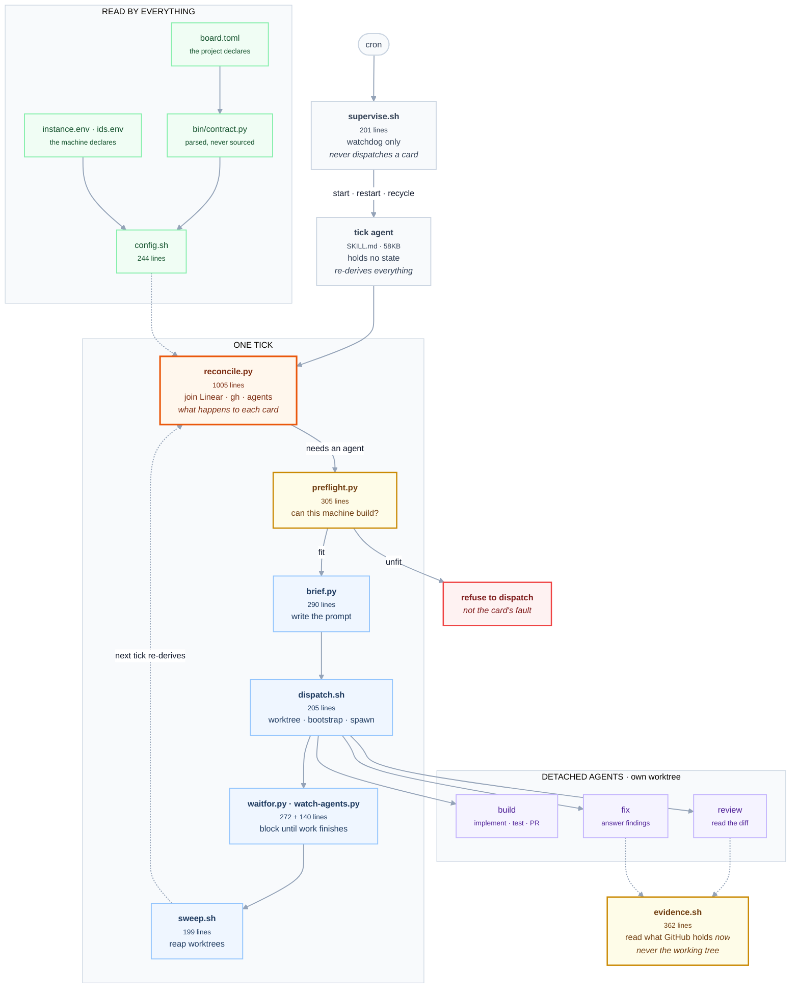

# What the board actually does

One tick, end to end. Line counts are current as of 2026-08-31.

GitHub renders the mermaid below. Nothing else does, so to see it anywhere else:

```bash
bin/render-diagram.sh docs/board-flow.md                    # SVG
bin/render-diagram.sh docs/board-flow.md docs/board-flow.png   # PNG, 3x
bin/render-diagram.sh --html docs/board-flow.md             # zoom and pan
```

The output extension picks the format. Every render is gitignored: the mermaid
above is the source, and a render is a view of it.

- **PNG** previews in the most places, and your image viewer's zoom works on it.
  It blurs past 3x.
- **SVG** stays sharp at any size, but many viewers will not preview it and none
  offer a zoom control.
- **`--html`** wraps the SVG in a page with scroll-to-zoom and drag-to-pan. Open
  it with `open docs/board-flow.html`.



## Three things the diagram shows that a file list does not

- **`supervise.sh` deliberately cannot dispatch.** A watchdog that could also
  dispatch would double-dispatch the moment it misjudged liveness. That
  separation is why it is a whole file and not a function.
- **`waitfor.py` and `watch-agents.py` share one box** because they do one job
  between them. This is the clearest merge in the skill.
- **The dotted line from `sweep.sh` back to `reconcile.py` is the whole design.**
  Nothing is carried between ticks. The next tick rebuilds the picture from
  Linear, `gh` and `claude agents`. That is why there is no state file, and why
  the sidecar is a cache and never truth.

## Where the weight is

| File | Lines | Verdict |
|---|---:|---|
| `reconcile.py` | 1005 | Where the complexity lives. 23% of the skill. |
| `evidence.sh` | 362 | Keep. Exists because the working tree gave wrong answers. |
| `preflight.py` | 305 | Keep the idea. The implementation looks larger than the job. |
| `brief.py` | 290 | Keep. Small, one job. |
| `waitfor.py` | 272 | Merge candidate. |
| `config.sh` | 244 | Keep. It is the config. |
| `dispatch.sh` | 205 | Keep. One job. |
| `supervise.sh` | 201 | Keep. Separate from dispatch on purpose. |
| `sweep.sh` | 199 | Could be a step in the tick rather than its own script. |
| `watch-agents.py` | 140 | Merge candidate, with `waitfor.py`. |
| `withlock.py` | 84 | Fine. Tiny. |

Twelve files, but the count is not the problem.

- Six do real work in a tick. The rest are config, a lock and a watchdog.
- The two merges above save roughly 200 lines and take the count to ten.
- The real weight is `reconcile.py` at 1005 lines and `SKILL.md` at 58KB. `SKILL.md`
  is larger than any code file in this repository.
