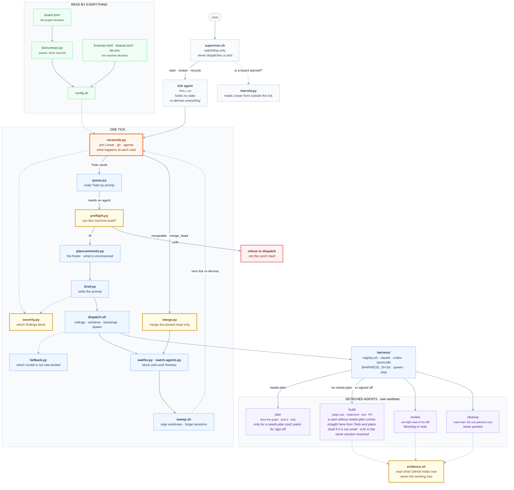

# What the board actually does

One tick, end to end.

GitHub renders the mermaid below. Nothing else does, so to read it anywhere
else:

```bash
bin/render-diagram.sh docs/board-flow.md && open docs/board-flow.html
```

That writes a self-contained page: scroll to zoom, drag to pan. It is gitignored.
The mermaid is the source; the page is a view of it.


```mermaid
%%{init: {
  "theme": "base",
  "themeVariables": {
    "fontFamily": "ui-sans-serif, -apple-system, BlinkMacSystemFont, Segoe UI, Helvetica, Arial, sans-serif",
    "fontSize": "13px",
    "lineColor": "#94a3b8",
    "primaryTextColor": "#0f172a",
    "clusterBkg": "#f8fafc",
    "clusterBorder": "#cbd5e1",
    "edgeLabelBackground": "#ffffff"
  },
  "flowchart": { "curve": "basis", "nodeSpacing": 40, "rankSpacing": 55, "padding": 14 }
}}%%
flowchart TD
    cron(["cron"]) --> sup

    sup["<b>supervise.sh</b><br/>watchdog only<br/><i>never dispatches a card</i>"]
    sup -->|"start · restart · recycle"| tick
    sup -.->|"is a board starved?"| stv["<b>starved.py</b><br/>reads Linear from outside the tick"]
    tick["<b>tick agent</b><br/><small>SKILL.md</small><br/>holds no state<br/><i>re-derives everything</i>"]

    subgraph ONETICK[" ONE TICK "]
        direction TB
        rec["<b>reconcile.py</b><br/>join Linear · gh · agents<br/><i>what happens to each card</i>"]
        sev["<b>severity.py</b><br/>which findings block"]
        que["<b>queue.py</b><br/>order Todo by priority"]
        pre["<b>preflight.py</b><br/>can this machine build?"]
        plc["<b>plancomments.py</b><br/>the footer · what is unconsumed"]
        bri["<b>brief.py</b><br/>write the prompt"]
        dis["<b>dispatch.sh</b><br/>ceilings · worktree · bootstrap · spawn"]
        fbk["<b>fallback.py</b><br/>which model is not rate-limited"]
        mrg["<b>merge.py</b><br/>merge the pinned head only"]
        wai["<b>waitfor.py · watch-agents.py</b><br/>block until work finishes"]
        swp["<b>sweep.sh</b><br/>reap worktrees · forget sessions"]
        rec -.-> sev
        rec -->|"Todo cards"| que
        que -->|"needs an agent"| pre
        pre -->|"fit"| plc
        plc --> bri
        bri -.-> sev
        bri --> dis
        dis -.-> fbk
        rec -->|"mergeable · merge_head"| mrg
        dis --> wai
        mrg --> wai
        wai --> swp
    end

    tick --> rec
    swp -.->|"next tick re-derives"| rec
    pre -->|"unfit"| stop["<b>refuse to dispatch</b><br/><i>not the card's fault</i>"]

    har["<b>harness/</b><br/>registry.sh · claude · codex · opencode<br/><i>$HARNESS_SH list · spawn · stop</i>"]
    dis --> har

    subgraph AGENTS[" DETACHED AGENTS · own worktree "]
        direction LR
        pln["plan<br/><small>draw the graph · post it · stop</small><br/><i>only for a needs-plan card; parks for sign-off</i>"]
        bld["build<br/><small>judge size · implement · test · PR</small><br/><i>a card without needs-plan comes straight here from Todo and plans itself if it is not small · a fix is this same session resumed</i>"]
        rev["review<br/><small>one light read of the diff</small><br/><i>blocking or note</i>"]
        cln["cleanup<br/><small>read main, file one planned card</small><br/><i>never pushes</i>"]
    end
    har -->|"needs-plan"| pln
    har -->|"no needs-plan · or signed off"| bld
    har --> rev
    har --> cln

    ev["<b>evidence.sh</b><br/>read what GitHub holds <i>now</i><br/><i>never the working tree</i>"]
    rev -.-> ev
    bld -.-> ev
    cln -.-> ev

    subgraph CONFIG[" READ BY EVERYTHING "]
        direction LR
        toml["board.toml<br/><small>the project declares</small>"]
        con["bin/contract.py<br/><small>parsed, never sourced</small>"]
        ids["foreman.toml · boards.toml · ids.env<br/><small>the machine declares</small>"]
        cfg["config.sh"]
        toml --> con --> cfg
        ids --> cfg
    end
    cfg -.-> rec

    classDef brain fill:#fff7ed,stroke:#ea580c,stroke-width:2.5px,color:#7c2d12
    classDef gate  fill:#fefce8,stroke:#ca8a04,stroke-width:2px,color:#713f12
    classDef step  fill:#eff6ff,stroke:#93c5fd,stroke-width:1.5px,color:#1e3a5f
    classDef stop  fill:#fef2f2,stroke:#ef4444,stroke-width:2px,color:#7f1d1d
    classDef cfgn  fill:#f0fdf4,stroke:#86efac,stroke-width:1.5px,color:#14532d
    classDef agent fill:#f5f3ff,stroke:#c4b5fd,stroke-width:1.5px,color:#4c1d95
    classDef edge  fill:#f8fafc,stroke:#cbd5e1,stroke-width:1.5px,color:#334155

    class rec brain
    class pre,ev,mrg,sev gate
    class que,plc,bri,dis,fbk,wai,swp,har step
    class sup,tick,cron,stv edge
    class stop stop
    class toml,con,ids,cfg cfgn
    class pln,bld,rev,cln agent

    linkStyle default stroke:#94a3b8,stroke-width:1.5px
```

## What the diagram shows that a file list does not

- **`supervise.sh` deliberately cannot dispatch.** A watchdog that could also
  dispatch would double-dispatch the moment it misjudged liveness. That
  separation is why it is a whole file and not a function.
- **`waitfor.py` and `watch-agents.py` share one box** because they do one job
  between them. This is the clearest merge in the skill.
- **The dotted line from `sweep.sh` back to `reconcile.py` is the whole design.**
  Nothing is carried between ticks. The next tick rebuilds the picture from
  Linear, `gh` and `"$HARNESS_SH" list`. That is why there is no state file, and
  why the sidecar is a cache and never truth.
- **The plan stage is a branch, not a step.** A `Todo` card without
  `needs-plan` goes straight to a build agent, which judges SMALL or PLANNED
  itself. Only a `needs-plan` card gets a separate plan agent and waits for the
  operator's sign-off.
- **`rev` runs once.** One reviewer, findings `blocking` or `note`. A blocking
  finding buys one fix, and the fix merges on green checks with no second
  review; quality work that used to wait for a second round now runs in `cln`
  instead.
- **`merge.py` merges one head.** It refuses unless the pull request's head is
  still the `merge_head` `reconcile.py` judged, and pins `gh pr merge` to it.

## The files

| File | Does |
|---|---|
| `reconcile.py` | Joins Linear, `gh` and the agent registry into one verdict per card. Where the complexity lives. |
| `severity.py` | Decides which review findings block, for `brief.py` and `reconcile.py` alike. |
| `queue.py` | Orders a board's `Todo` cards by Linear priority. |
| `preflight.py` | Proves the machine can build before anything is spawned. |
| `plancomments.py` | Reads a card's comments: the plan footer, what the operator said that no plan consumed. |
| `brief.py` | Writes every prompt. The only thing that quotes agent-written text. |
| `dispatch.sh` | Holds both concurrency ceilings, cuts the worktree, spawns or resumes. |
| `fallback.py` | Picks the model a stage runs on while its first choice is rate-limited. |
| `harness/` | One adapter per CLI, and `registry.sh`, which merges them into `$HARNESS_SH`. |
| `merge.py` | Merges a card's pull request at the pinned head, with the fast-track label synced. |
| `route.py` | Reads a card's label names, whatever shape Linear sends them in, for `merge.py`. |
| `evidence.sh` | Reads what GitHub holds now. Exists because the working tree gave wrong answers. |
| `waitfor.py` · `watch-agents.py` | Block until a check, review, deploy or agent finishes. Merge candidates. |
| `sweep.sh` | Reaps worktrees, forgets sessions, releases slots. |
| `supervise.sh` | The watchdog. Separate from dispatch on purpose. |
| `starved.py` | Tells `supervise.sh` a board's `Todo` has waited too long. |
| `withlock.py` | Serialises shared git metadata. |
| `config.sh` | The config. Parses the contract; never sources a target's file. |

`SKILL.md` is larger than any code file in this repository, and it is the one
file every tick reads end to end.
