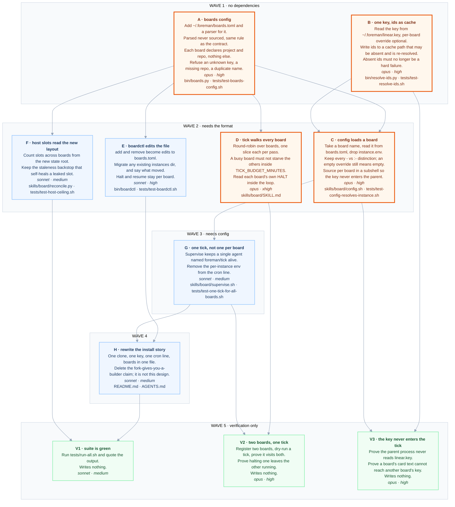

```mermaid
%%{init: {
  "theme": "base",
  "themeVariables": {
    "fontFamily": "Arial, Helvetica, sans-serif",
    "fontSize": "13px",
    "lineColor": "#94a3b8",
    "primaryTextColor": "#0f172a",
    "clusterBkg": "#f8fafc",
    "clusterBorder": "#cbd5e1"
  },
  "flowchart": { "curve": "basis", "nodeSpacing": 40, "rankSpacing": 60, "padding": 14 }
}}%%
flowchart TD

  subgraph W1["WAVE 1 · no dependencies"]
    direction LR
    A["<b>A · boards config</b><br/>Add ~/.foreman/boards.toml and a parser for it.<br/>Parsed never sourced, same rule as the contract.<br/>Each board declares project and repo, nothing else.<br/>Refuse an unknown key, a missing repo, a duplicate name.<br/><i>opus · high</i><br/>bin/boards.py · tests/test-boards-config.sh"]
    B["<b>B · one key, ids as cache</b><br/>Read the key from ~/.foreman/linear.key, per-board override optional.<br/>Write ids to a cache path that may be absent and is re-resolved.<br/>Absent ids must no longer be a hard failure.<br/><i>opus · high</i><br/>bin/resolve-ids.py · tests/test-resolve-ids.sh"]
  end

  subgraph W2["WAVE 2 · needs the format"]
    direction LR
    C["<b>C · config loads a board</b><br/>Take a board name, read it from boards.toml, drop instance.env.<br/>Keep every - vs :- distinction; an empty override still means empty.<br/>Source per board in a subshell so the key never enters the parent.<br/><i>opus · high</i><br/>skills/board/config.sh · tests/test-config-resolves-instance.sh"]
    D["<b>D · tick walks every board</b><br/>Round-robin over boards, one slice each per pass.<br/>A busy board must not starve the others inside TICK_BUDGET_MINUTES.<br/>Read each board's own HALT inside the loop.<br/><i>opus · xhigh</i><br/>skills/board/SKILL.md"]
    E["<b>E · boardctl edits the file</b><br/>add and remove become edits to boards.toml.<br/>Migrate any existing instances dir, and say what moved.<br/>Halt and resume stay per board.<br/><i>sonnet · high</i><br/>bin/boardctl · tests/test-boardctl.sh"]
    F["<b>F · host slots read the new layout</b><br/>Count slots across boards from the new state root.<br/>Keep the staleness backstop that self-heals a leaked slot.<br/><i>sonnet · medium</i><br/>skills/board/reconcile.py · tests/test-host-ceiling.sh"]
  end

  subgraph W3["WAVE 3 · needs config"]
    G["<b>G · one tick, not one per board</b><br/>Supervise keeps a single agent named foreman/tick alive.<br/>Remove the per-instance env from the cron line.<br/><i>sonnet · medium</i><br/>skills/board/supervise.sh · tests/test-one-tick-for-all-boards.sh"]
  end

  subgraph W4["WAVE 4"]
    H["<b>H · rewrite the install story</b><br/>One clone, one key, one cron line, boards in one file.<br/>Delete the fork-gives-you-a-builder claim; it is not this design.<br/><i>sonnet · medium</i><br/>README.md · AGENTS.md"]
  end

  subgraph W5["WAVE 5 · verification only"]
    direction LR
    V1["<b>V1 · suite is green</b><br/>Run tests/run-all.sh and quote the output.<br/>Writes nothing.<br/><i>sonnet · medium</i>"]
    V2["<b>V2 · two boards, one tick</b><br/>Register two boards, dry-run a tick, prove it visits both.<br/>Prove halting one leaves the other running.<br/>Writes nothing.<br/><i>opus · high</i>"]
    V3["<b>V3 · the key never enters the tick</b><br/>Prove the parent process never reads linear.key.<br/>Prove a board's card text cannot reach another board's key.<br/>Writes nothing.<br/><i>opus · high</i>"]
  end

  A --> C
  A --> D
  A --> E
  A --> F
  B --> C
  C --> G
  E --> H
  G --> H
  D --> V2
  G --> V2
  H --> V1
  F --> V1
  B --> V3
  C --> V3

  classDef hi   fill:#fff7ed,stroke:#ea580c,stroke-width:2.5px,color:#7c2d12
  classDef mid  fill:#eff6ff,stroke:#93c5fd,stroke-width:1.5px,color:#1e3a5f
  classDef ver  fill:#f0fdf4,stroke:#86efac,stroke-width:1.5px,color:#14532d
  class A,B,C,D hi
  class E,F,G,H mid
  class V1,V2,V3 ver
```
