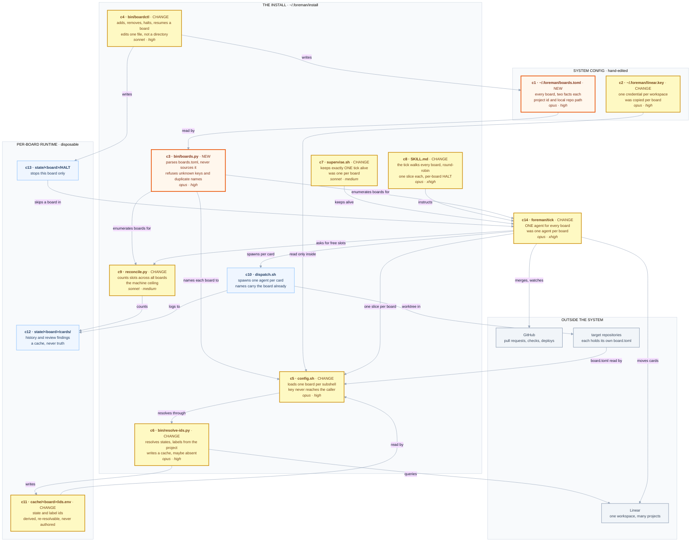

```mermaid
%%{init: {
  "theme": "base",
  "themeVariables": {
    "fontFamily": "Arial, Helvetica, sans-serif",
    "fontSize": "13px",
    "lineColor": "#94a3b8",
    "primaryTextColor": "#0f172a",
    "clusterBkg": "#f8fafc",
    "clusterBorder": "#cbd5e1"
  },
  "flowchart": { "curve": "basis", "nodeSpacing": 38, "rankSpacing": 55, "padding": 14 }
}}%%
flowchart TD

  subgraph OUT["OUTSIDE THE SYSTEM"]
    direction LR
    lin["Linear<br/>one workspace, many projects"]
    gh["GitHub<br/>pull requests, checks, deploys"]
    repos["target repositories<br/>each holds its own board.toml"]
  end

  subgraph CFG["SYSTEM CONFIG · hand-edited"]
    direction LR
    boards["<b>c1 · ~/.foreman/boards.toml</b> · NEW<br/>every board, two facts each<br/>project id and local repo path<br/><i>opus · high</i>"]
    key["<b>c2 · ~/.foreman/linear.key</b> · CHANGE<br/>one credential per workspace<br/>was copied per board<br/><i>opus · high</i>"]
  end

  subgraph CODE["THE INSTALL · ~/.foreman/install"]
    direction TB
    parse["<b>c3 · bin/boards.py</b> · NEW<br/>parses boards.toml, never sources it<br/>refuses unknown keys and duplicate names<br/><i>opus · high</i>"]
    ctl["<b>c4 · bin/boardctl</b> · CHANGE<br/>adds, removes, halts, resumes a board<br/>edits one file, not a directory<br/><i>sonnet · high</i>"]
    cfg["<b>c5 · config.sh</b> · CHANGE<br/>loads one board per subshell<br/>key never reaches the caller<br/><i>opus · high</i>"]
    ids["<b>c6 · bin/resolve-ids.py</b> · CHANGE<br/>resolves states, labels from the project<br/>writes a cache, maybe absent<br/><i>opus · high</i>"]
    sup["<b>c7 · supervise.sh</b> · CHANGE<br/>keeps exactly ONE tick alive<br/>was one per board<br/><i>sonnet · medium</i>"]
    skill["<b>c8 · SKILL.md</b> · CHANGE<br/>the tick walks every board, round-robin<br/>one slice each, per-board HALT<br/><i>opus · xhigh</i>"]
    rec["<b>c9 · reconcile.py</b> · CHANGE<br/>counts slots across all boards<br/>the machine ceiling<br/><i>sonnet · medium</i>"]
    disp["<b>c10 · dispatch.sh</b><br/>spawns one agent per card<br/>names carry the board already"]
  end

  subgraph RUN["PER-BOARD RUNTIME · disposable"]
    direction LR
    cache["<b>c11 · cache/&lt;board&gt;/ids.env</b> · CHANGE<br/>state and label ids<br/>derived, re-resolvable, never authored"]
    cards["<b>c12 · state/&lt;board&gt;/cards/</b><br/>history and review findings<br/>a cache, never truth"]
    halt["<b>c13 · state/&lt;board&gt;/HALT</b><br/>stops this board only"]
  end

  tick["<b>c14 · foreman/tick</b> · CHANGE<br/>ONE agent for every board<br/>was one agent per board<br/><i>opus · xhigh</i>"]

  ctl -->|writes| boards
  ctl -->|writes| halt
  boards -->|read by| parse
  parse -->|names each board to| cfg
  parse -->|enumerates boards for| rec
  key -->|read only inside| cfg
  cfg -->|resolves through| ids
  ids -->|writes| cache
  ids -->|queries| lin
  cache -->|read by| cfg
  repos -->|board.toml read by| cfg

  sup -->|keeps alive| tick
  skill -->|instructs| tick
  parse -->|enumerates boards for| tick
  tick -->|one slice per board| cfg
  halt -->|skips a board in| tick
  tick -->|asks for free slots| rec
  rec -->|counts| cards
  tick -->|spawns per card| disp
  disp -->|worktree in| repos
  disp -->|logs to| cards
  tick -->|moves cards| lin
  tick -->|merges, watches| gh

  classDef new  fill:#fff7ed,stroke:#ea580c,stroke-width:2.5px,color:#7c2d12
  classDef chg  fill:#fef9c3,stroke:#ca8a04,stroke-width:2px,color:#713f12
  classDef same fill:#eff6ff,stroke:#93c5fd,stroke-width:1.5px,color:#1e3a5f
  classDef ext  fill:#f1f5f9,stroke:#94a3b8,stroke-width:1.5px,color:#334155
  class boards,parse new
  class key,ctl,cfg,ids,sup,skill,rec,tick,cache chg
  class disp,cards,halt same
  class lin,gh,repos ext
```
