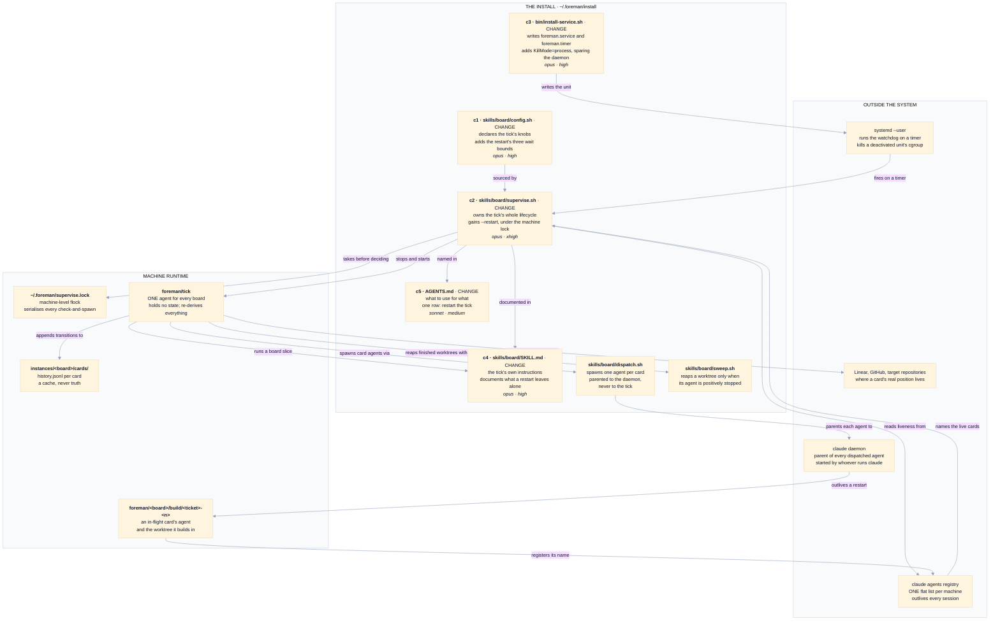

```mermaid
%%{init: {
  "theme": "base",
  "themeVariables": {
    "fontFamily": "Arial, Helvetica, sans-serif",
    "fontSize": "13px",
    "lineColor": "#94a3b8",
    "primaryTextColor": "#0f172a",
    "clusterBkg": "#f8fafc",
    "clusterBorder": "#cbd5e1"
  },
  "flowchart": { "curve": "basis", "nodeSpacing": 38, "rankSpacing": 55, "padding": 14 }
}}%%
flowchart TD

  subgraph OUT["OUTSIDE THE SYSTEM"]
    direction LR
    sysd["systemd --user<br/>runs the watchdog on a timer<br/>kills a deactivated unit's cgroup"]
    reg["claude agents registry<br/>ONE flat list per machine<br/>outlives every session"]
    daemon["claude daemon<br/>parent of every dispatched agent<br/>started by whoever runs claude"]
    forge["Linear, GitHub, target repositories<br/>where a card's real position lives"]
  end

  subgraph CODE["THE INSTALL · ~/.foreman/install"]
    direction TB
    cfg["<b>c1 · skills/board/config.sh</b> · CHANGE<br/>declares the tick's knobs<br/>adds the restart's three wait bounds<br/><i>opus · high</i>"]
    sup["<b>c2 · skills/board/supervise.sh</b> · CHANGE<br/>owns the tick's whole lifecycle<br/>gains --restart, under the machine lock<br/><i>opus · xhigh</i>"]
    inst["<b>c3 · bin/install-service.sh</b> · CHANGE<br/>writes foreman.service and foreman.timer<br/>adds KillMode=process, sparing the daemon<br/><i>opus · high</i>"]
    skill["<b>c4 · skills/board/SKILL.md</b> · CHANGE<br/>the tick's own instructions<br/>documents what a restart leaves alone<br/><i>opus · high</i>"]
    agents["<b>c5 · AGENTS.md</b> · CHANGE<br/>what to use for what<br/>one row: restart the tick<br/><i>sonnet · medium</i>"]
    disp["<b>skills/board/dispatch.sh</b><br/>spawns one agent per card<br/>parented to the daemon,<br/>never to the tick"]
    sweep["<b>skills/board/sweep.sh</b><br/>reaps a worktree only when<br/>its agent is positively stopped"]
  end

  subgraph RUN["MACHINE RUNTIME"]
    direction TB
    lock["<b>~/.foreman/supervise.lock</b><br/>machine-level flock<br/>serialises every check-and-spawn"]
    tick["<b>foreman/tick</b><br/>ONE agent for every board<br/>holds no state; re-derives everything"]
    card["<b>foreman/&lt;board&gt;/build/&lt;ticket&gt;-&lt;n&gt;</b><br/>an in-flight card's agent<br/>and the worktree it builds in"]
    cards["<b>instances/&lt;board&gt;/cards/</b><br/>history.jsonl per card<br/>a cache, never truth"]
  end

  sysd -->|fires on a timer| sup
  inst -->|writes the unit| sysd
  cfg -->|sourced by| sup
  sup -->|takes before deciding| lock
  sup -->|stops and starts| tick
  sup -->|reads liveness from| reg
  tick -->|runs a board slice| skill
  tick -->|spawns card agents via| disp
  disp -->|parents each agent to| daemon
  daemon -->|outlives a restart| card
  card -->|registers its name| reg
  reg -->|names the live cards| sup
  tick -->|appends transitions to| cards
  tick -->|re-derives positions from| forge
  tick -->|reaps finished worktrees with| sweep
  sup -->|documented in| skill
  sup -->|named in| agents
```
