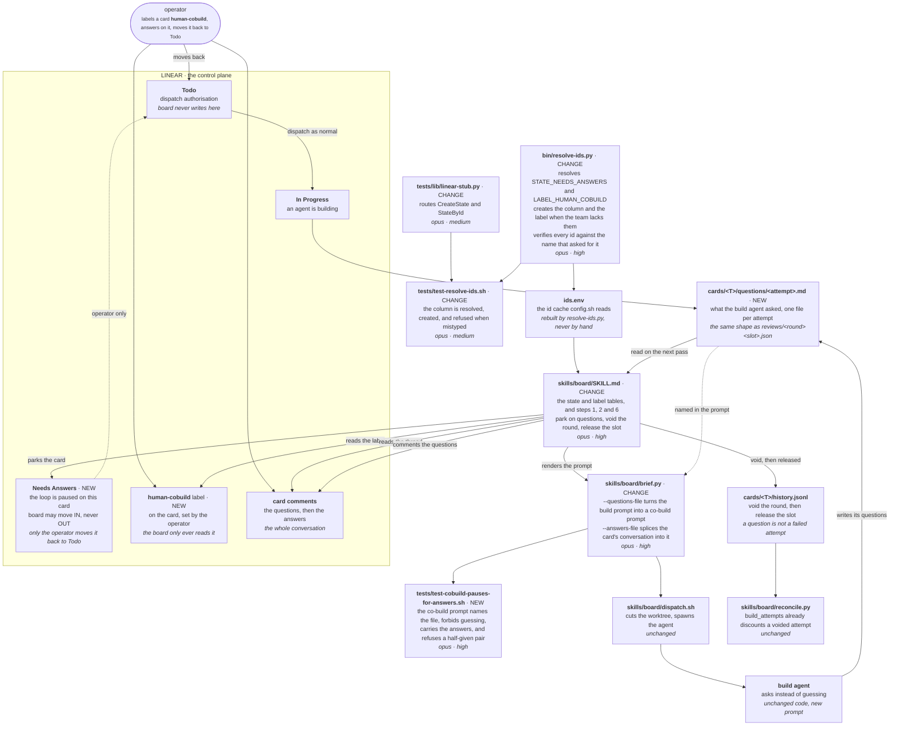

```mermaid
flowchart TD
    op(["operator<br/><small>labels a card <b>human-cobuild</b>, answers on it, moves it back to Todo</small>"])

    subgraph LINEAR[" LINEAR · the control plane "]
        direction LR
        todo["<b>Todo</b><br/>dispatch authorisation<br/><i>board never writes here</i>"]
        prog["<b>In Progress</b><br/>an agent is building"]
        needs["<b>Needs Answers</b> · NEW<br/>the loop is paused on this card<br/>board may move IN, never OUT<br/><i>only the operator moves it back to Todo</i>"]
        lbl["<b>human-cobuild</b> label · NEW<br/>on the card, set by the operator<br/><i>the board only ever reads it</i>"]
        cmt["<b>card comments</b><br/>the questions, then the answers<br/><i>the whole conversation</i>"]
    end

    ids["<b>bin/resolve-ids.py</b> · CHANGE<br/>resolves STATE_NEEDS_ANSWERS and LABEL_HUMAN_COBUILD<br/>creates the column and the label when the team lacks them<br/>verifies every id against the name that asked for it<br/><i>opus · high</i>"]
    idsenv["<b>ids.env</b><br/>the id cache config.sh reads<br/><i>rebuilt by resolve-ids.py, never by hand</i>"]

    stub["<b>tests/lib/linear-stub.py</b> · CHANGE<br/>routes CreateState and StateById<br/><i>opus · medium</i>"]
    tids["<b>tests/test-resolve-ids.sh</b> · CHANGE<br/>the column is resolved, created, and refused when mistyped<br/><i>opus · medium</i>"]

    brief["<b>skills/board/brief.py</b> · CHANGE<br/>--questions-file turns the build prompt into a co-build prompt<br/>--answers-file splices the card's conversation into it<br/><i>opus · high</i>"]
    tbrief["<b>tests/test-cobuild-pauses-for-answers.sh</b> · NEW<br/>the co-build prompt names the file, forbids guessing,<br/>carries the answers, and refuses a half-given pair<br/><i>opus · high</i>"]

    skill["<b>skills/board/SKILL.md</b> · CHANGE<br/>the state and label tables, and steps 1, 2 and 6<br/>park on questions, void the round, release the slot<br/><i>opus · high</i>"]

    qfile["<b>cards/&lt;T&gt;/questions/&lt;attempt&gt;.md</b> · NEW<br/>what the build agent asked, one file per attempt<br/><i>the same shape as reviews/&lt;round&gt;&lt;slot&gt;.json</i>"]
    hist["<b>cards/&lt;T&gt;/history.jsonl</b><br/>void the round, then release the slot<br/><i>a question is not a failed attempt</i>"]

    disp["<b>skills/board/dispatch.sh</b><br/>cuts the worktree, spawns the agent<br/><i>unchanged</i>"]
    bld["<b>build agent</b><br/>asks instead of guessing<br/><i>unchanged code, new prompt</i>"]
    rec["<b>skills/board/reconcile.py</b><br/>build_attempts already discounts a voided attempt<br/><i>unchanged</i>"]

    op --> lbl
    op --> cmt
    op -->|"moves back"| todo
    needs -.->|"operator only"| todo

    ids --> idsenv
    idsenv --> skill
    stub --> tids
    ids --> tids

    skill -->|"reads the label"| lbl
    skill -->|"reads the thread"| cmt
    skill -->|"renders the prompt"| brief
    brief --> disp --> bld
    bld -->|"writes its questions"| qfile
    qfile -->|"read on the next pass"| skill
    skill -->|"comments the questions"| cmt
    skill -->|"parks the card"| needs
    skill -->|"void, then released"| hist
    hist --> rec
    brief --> tbrief
    qfile -.->|"named in the prompt"| brief
    todo -->|"dispatch as normal"| prog
    prog --> qfile
```
