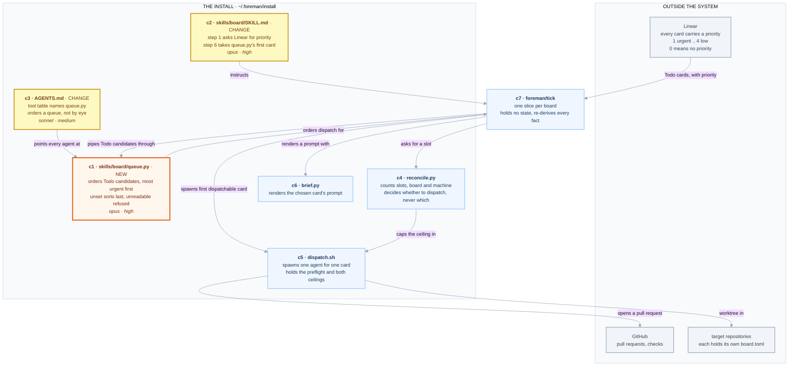

```mermaid
%%{init: {
  "theme": "base",
  "themeVariables": {
    "fontFamily": "Arial, Helvetica, sans-serif",
    "fontSize": "13px",
    "lineColor": "#94a3b8",
    "primaryTextColor": "#0f172a",
    "clusterBkg": "#f8fafc",
    "clusterBorder": "#cbd5e1"
  },
  "flowchart": { "curve": "basis", "nodeSpacing": 38, "rankSpacing": 55, "padding": 14 }
}}%%
flowchart TD

  subgraph OUT["OUTSIDE THE SYSTEM"]
    direction LR
    lin["Linear<br/>every card carries a priority<br/>1 urgent .. 4 low<br/>0 means no priority"]
    gh["GitHub<br/>pull requests, checks"]
    repos["target repositories<br/>each holds its own board.toml"]
  end

  subgraph CODE["THE INSTALL · ~/.foreman/install"]
    direction TB
    queue["<b>c1 · skills/board/queue.py</b> · NEW<br/>orders Todo candidates, most urgent first<br/>unset sorts last, unreadable refused<br/><i>opus · high</i>"]
    skill["<b>c2 · skills/board/SKILL.md</b> · CHANGE<br/>step 1 asks Linear for priority<br/>step 6 takes queue.py's first card<br/><i>opus · high</i>"]
    agents["<b>c3 · AGENTS.md</b> · CHANGE<br/>tool table names queue.py<br/>orders a queue, not by eye<br/><i>sonnet · medium</i>"]
    rec["<b>c4 · reconcile.py</b><br/>counts slots, board and machine<br/>decides whether to dispatch, never which"]
    disp["<b>c5 · dispatch.sh</b><br/>spawns one agent for one card<br/>holds the preflight and both ceilings"]
    brief["<b>c6 · brief.py</b><br/>renders the chosen card's prompt"]
  end

  tick["<b>c7 · foreman/tick</b><br/>one slice per board<br/>holds no state, re-derives every fact"]

  lin -->|Todo cards, with priority| tick
  skill -->|instructs| tick
  agents -->|points every agent at| queue
  tick -->|pipes Todo candidates through| queue
  queue -->|orders dispatch for| tick
  tick -->|asks for a slot| rec
  tick -->|renders a prompt with| brief
  tick -->|spawns first dispatchable card| disp
  rec -->|caps the ceiling in| disp
  disp -->|worktree in| repos
  disp -->|opens a pull request| gh

  classDef new  fill:#fff7ed,stroke:#ea580c,stroke-width:2.5px,color:#7c2d12
  classDef chg  fill:#fef9c3,stroke:#ca8a04,stroke-width:2px,color:#713f12
  classDef same fill:#eff6ff,stroke:#93c5fd,stroke-width:1.5px,color:#1e3a5f
  classDef ext  fill:#f1f5f9,stroke:#94a3b8,stroke-width:1.5px,color:#334155
  class queue new
  class skill,agents chg
  class rec,disp,brief,tick same
  class lin,gh,repos ext
```
