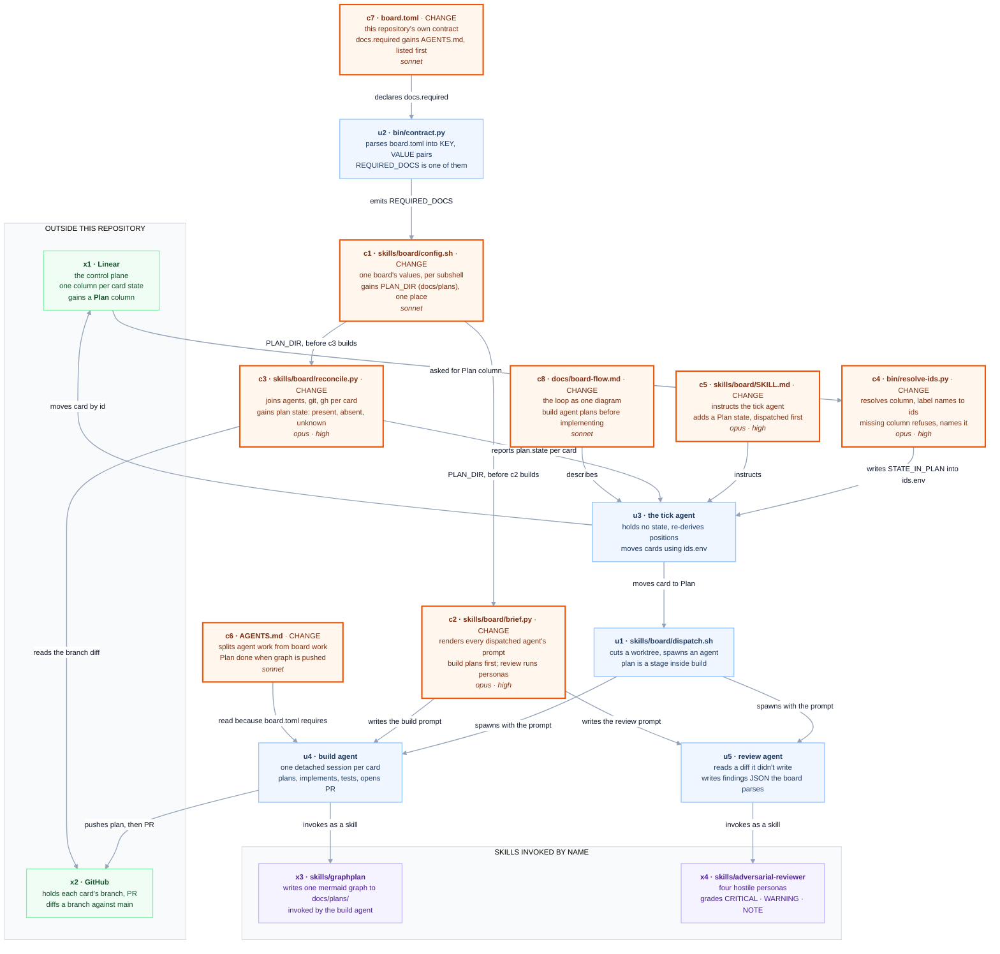

```mermaid
%%{init: {
  "theme": "base",
  "themeVariables": {
    "fontFamily": "ui-sans-serif, -apple-system, BlinkMacSystemFont, Segoe UI, Helvetica, Arial, sans-serif",
    "fontSize": "13px",
    "lineColor": "#94a3b8",
    "primaryTextColor": "#0f172a",
    "clusterBkg": "#f8fafc",
    "clusterBorder": "#cbd5e1",
    "edgeLabelBackground": "#ffffff"
  },
  "flowchart": { "curve": "basis", "nodeSpacing": 40, "rankSpacing": 60, "padding": 14 }
}}%%
flowchart TD

    subgraph OUTSIDE[" OUTSIDE THIS REPOSITORY "]
        direction LR
        x1["<b>x1 · Linear</b><br/>the control plane<br/>one column per card state<br/>gains a <b>Plan</b> column"]
        x2["<b>x2 · GitHub</b><br/>holds each card's branch, PR<br/>diffs a branch against main"]
    end

    subgraph SKILLS[" SKILLS INVOKED BY NAME "]
        direction LR
        x3["<b>x3 · skills/graphplan</b><br/>writes one mermaid graph to docs/plans/<br/>invoked by the build agent"]
        x4["<b>x4 · skills/adversarial-reviewer</b><br/>four hostile personas<br/>grades CRITICAL · WARNING · NOTE"]
    end

    c7["<b>c7 · board.toml</b> · CHANGE<br/>this repository's own contract<br/>docs.required gains AGENTS.md, listed first<br/><i>sonnet</i>"]
    u2["<b>u2 · bin/contract.py</b><br/>parses board.toml into KEY, VALUE pairs<br/>REQUIRED_DOCS is one of them"]
    c1["<b>c1 · skills/board/config.sh</b> · CHANGE<br/>one board's values, per subshell<br/>gains PLAN_DIR (docs/plans), one place<br/><i>sonnet</i>"]
    c4["<b>c4 · bin/resolve-ids.py</b> · CHANGE<br/>resolves column, label names to ids<br/>missing column refuses, names it<br/><i>opus · high</i>"]
    c2["<b>c2 · skills/board/brief.py</b> · CHANGE<br/>renders every dispatched agent's prompt<br/>build plans first; review runs personas<br/><i>opus · high</i>"]
    c3["<b>c3 · skills/board/reconcile.py</b> · CHANGE<br/>joins agents, git, gh per card<br/>gains plan state: present, absent, unknown<br/><i>opus · high</i>"]
    c5["<b>c5 · skills/board/SKILL.md</b> · CHANGE<br/>instructs the tick agent<br/>adds a Plan state, dispatched first<br/><i>opus · high</i>"]
    c6["<b>c6 · AGENTS.md</b> · CHANGE<br/>splits agent work from board work<br/>Plan done when graph is pushed<br/><i>sonnet</i>"]
    c8["<b>c8 · docs/board-flow.md</b> · CHANGE<br/>the loop as one diagram<br/>build agent plans before implementing<br/><i>sonnet</i>"]

    u3["<b>u3 · the tick agent</b><br/>holds no state, re-derives positions<br/>moves cards using ids.env"]
    u1["<b>u1 · skills/board/dispatch.sh</b><br/>cuts a worktree, spawns an agent<br/>plan is a stage inside build"]
    u4["<b>u4 · build agent</b><br/>one detached session per card<br/>plans, implements, tests, opens PR"]
    u5["<b>u5 · review agent</b><br/>reads a diff it didn't write<br/>writes findings JSON the board parses"]

    c7 -->|"declares docs.required"| u2
    u2 -->|"emits REQUIRED_DOCS"| c1
    c1 -->|"PLAN_DIR, before c2 builds"| c2
    c1 -->|"PLAN_DIR, before c3 builds"| c3
    x1 -->|"asked for Plan column"| c4
    c4 -->|"writes STATE_IN_PLAN into ids.env"| u3
    c5 -->|"instructs"| u3
    c3 -->|"reports plan.state per card"| u3
    u3 -->|"moves card to Plan"| u1
    u3 -->|"moves card by id"| x1
    u1 -->|"spawns with the prompt"| u4
    u1 -->|"spawns with the prompt"| u5
    c2 -->|"writes the build prompt"| u4
    c2 -->|"writes the review prompt"| u5
    c6 -->|"read because board.toml requires"| u4
    u4 -->|"invokes as a skill"| x3
    u4 -->|"pushes plan, then PR"| x2
    u5 -->|"invokes as a skill"| x4
    c3 -->|"reads the branch diff"| x2
    c8 -->|"describes"| u3

    classDef chg   fill:#fff7ed,stroke:#ea580c,stroke-width:2.5px,color:#7c2d12
    classDef keep  fill:#eff6ff,stroke:#93c5fd,stroke-width:1.5px,color:#1e3a5f
    classDef out   fill:#f0fdf4,stroke:#86efac,stroke-width:1.5px,color:#14532d
    classDef skill fill:#f5f3ff,stroke:#c4b5fd,stroke-width:1.5px,color:#4c1d95

    class c1,c2,c3,c4,c5,c6,c7,c8 chg
    class u1,u2,u3,u4,u5 keep
    class x1,x2 out
    class x3,x4 skill

    linkStyle default stroke:#94a3b8,stroke-width:1.5px
```
