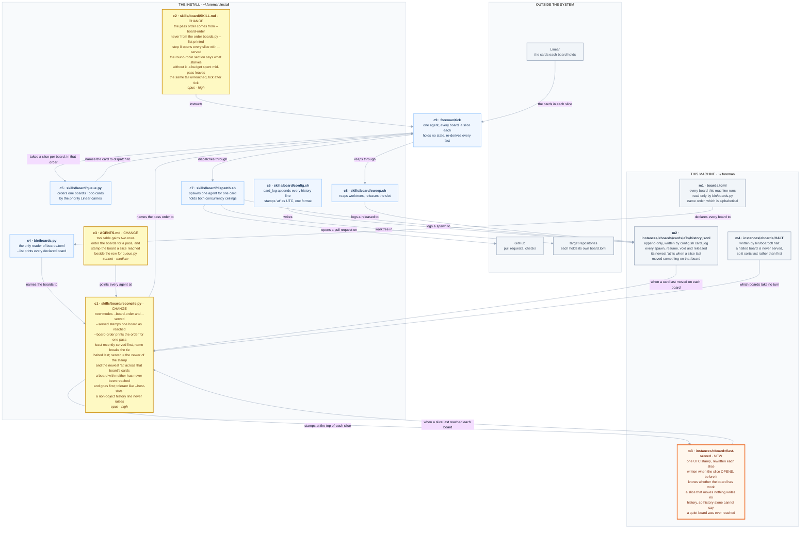

```mermaid
%%{init: {
  "theme": "base",
  "themeVariables": {
    "fontFamily": "Arial, Helvetica, sans-serif",
    "fontSize": "13px",
    "lineColor": "#94a3b8",
    "primaryTextColor": "#0f172a",
    "clusterBkg": "#f8fafc",
    "clusterBorder": "#cbd5e1"
  },
  "flowchart": { "curve": "basis", "nodeSpacing": 38, "rankSpacing": 55, "padding": 14 }
}}%%
flowchart TD

  subgraph OUT["OUTSIDE THE SYSTEM"]
    direction LR
    lin["Linear<br/>the cards each board holds"]
    gh["GitHub<br/>pull requests, checks"]
    repos["target repositories<br/>each holds its own board.toml"]
  end

  subgraph MACHINE["THIS MACHINE · ~/.foreman"]
    direction TB
    decl["<b>m1 · boards.toml</b><br/>every board this machine runs<br/>read only by bin/boards.py<br/>name order, which is alphabetical"]
    hist["<b>m2 · instances/&lt;board&gt;/cards/&lt;T&gt;/history.jsonl</b><br/>append-only, written by config.sh card_log<br/>every spawn, resume, void and released<br/>its newest 'at' is when a slice last<br/>moved something on that board"]
    stamp["<b>m3 · instances/&lt;board&gt;/last-served</b> · NEW<br/>one UTC stamp, rewritten each slice<br/>written when the slice OPENS, before it<br/>knows whether the board has work<br/>a slice that moves nothing writes no<br/>history, so history alone cannot say<br/>a quiet board was ever reached"]
    halt["<b>m4 · instances/&lt;board&gt;/HALT</b><br/>written by bin/boardctl halt<br/>a halted board is never served,<br/>so it sorts last rather than first"]
  end

  subgraph CODE["THE INSTALL · ~/.foreman/install"]
    direction TB
    rec["<b>c1 · skills/board/reconcile.py</b> · CHANGE<br/>new modes --board-order and --served<br/>--served stamps one board as reached<br/>--board-order prints the order for one pass<br/>least recently served first, name breaks the tie<br/>halted last; served = the newer of the stamp<br/>and the newest 'at' across that board's cards<br/>a board with neither has never been reached<br/>and goes first; tolerant like --host-slots:<br/>a non-object history line never raises<br/><i>opus · high</i>"]
    skill["<b>c2 · skills/board/SKILL.md</b> · CHANGE<br/>the pass order comes from --board-order<br/>never from the order boards.py --list printed<br/>step 0 opens every slice with --served<br/>the round-robin section says what starves<br/>without it: a budget spent mid-pass leaves<br/>the same tail unreached, tick after tick<br/><i>opus · high</i>"]
    agents["<b>c3 · AGENTS.md</b> · CHANGE<br/>tool table gains two rows<br/>order the boards for a pass, and<br/>stamp the board a slice reached<br/>beside the row for queue.py<br/><i>sonnet · medium</i>"]
    boards["<b>c4 · bin/boards.py</b><br/>the only reader of boards.toml<br/>--list prints every declared board"]
    queue["<b>c5 · skills/board/queue.py</b><br/>orders one board's Todo cards<br/>by the priority Linear carries"]
    cfg["<b>c6 · skills/board/config.sh</b><br/>card_log appends every history line<br/>stamps 'at' as UTC, one format"]
    disp["<b>c7 · skills/board/dispatch.sh</b><br/>spawns one agent for one card<br/>holds both concurrency ceilings"]
    swp["<b>c8 · skills/board/sweep.sh</b><br/>reaps worktrees, releases the slot"]
  end

  tick["<b>c9 · foreman/tick</b><br/>one agent, every board, a slice each<br/>holds no state, re-derives every fact"]

  decl -->|declares every board to| boards
  boards -->|names the boards to| rec
  hist -->|when a card last moved on each board| rec
  stamp -->|when a slice last reached each board| rec
  halt -->|which boards take no turn| rec
  rec -->|stamps at the top of each slice| stamp
  cfg -->|writes| hist
  disp -->|logs a spawn to| hist
  swp -->|logs a released to| hist
  skill -->|instructs| tick
  agents -->|points every agent at| rec
  rec -->|names the pass order to| tick
  tick -->|takes a slice per board, in that order| queue
  queue -->|names the card to dispatch to| tick
  tick -->|dispatches through| disp
  tick -->|reaps through| swp
  lin -->|the cards in each slice| tick
  disp -->|worktree in| repos
  disp -->|opens a pull request on| gh

  classDef new  fill:#fff7ed,stroke:#ea580c,stroke-width:2.5px,color:#7c2d12
  classDef chg  fill:#fef9c3,stroke:#ca8a04,stroke-width:2px,color:#713f12
  classDef same fill:#eff6ff,stroke:#93c5fd,stroke-width:1.5px,color:#1e3a5f
  classDef ext  fill:#f1f5f9,stroke:#94a3b8,stroke-width:1.5px,color:#334155
  class rec,skill,agents chg
  class boards,queue,cfg,disp,swp,tick same
  class lin,gh,repos ext
  class stamp new
  class decl,hist,halt ext
```
