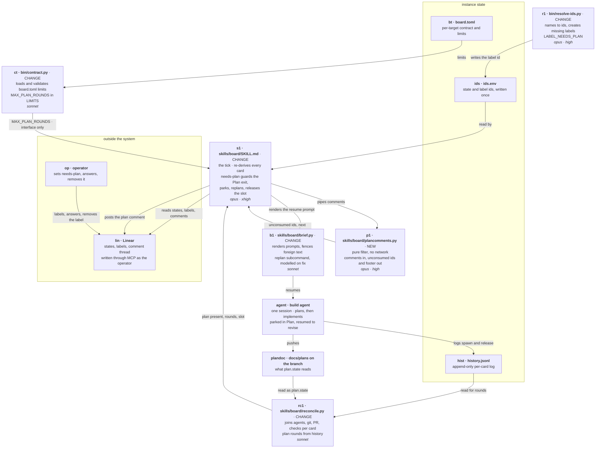

```mermaid
flowchart TD

  subgraph outside["outside the system"]
    op["<b>op · operator</b><br/>sets needs-plan, answers, removes it"]
    lin["<b>lin · Linear</b><br/>states, labels, comment thread<br/>written through MCP as the operator"]
  end

  subgraph inst["instance state"]
    ids["<b>ids · ids.env</b><br/>state and label ids, written once"]
    hist["<b>hist · history.jsonl</b><br/>append-only per-card log"]
    bt["<b>bt · board.toml</b><br/>per-target contract and limits"]
  end

  agent["<b>agent · build agent</b><br/>one session · plans, then implements<br/>parked in Plan, resumed to revise"]
  plandoc["<b>plandoc · docs/plans on the branch</b><br/>what plan.state reads"]

  ct["<b>ct · bin/contract.py</b> · CHANGE<br/>loads and validates board.toml limits<br/>MAX_PLAN_ROUNDS in LIMITS<br/><i>sonnet</i>"]
  r1["<b>r1 · bin/resolve-ids.py</b> · CHANGE<br/>names to ids, creates missing labels<br/>LABEL_NEEDS_PLAN<br/><i>opus · high</i>"]
  p1["<b>p1 · skills/board/plancomments.py</b> · NEW<br/>pure filter, no network<br/>comments in, unconsumed ids and footer out<br/><i>opus · high</i>"]
  b1["<b>b1 · skills/board/brief.py</b> · CHANGE<br/>renders prompts, fences foreign text<br/>replan subcommand, modelled on fix<br/><i>sonnet</i>"]
  rc1["<b>rc1 · skills/board/reconcile.py</b> · CHANGE<br/>joins agents, git, PR, checks per card<br/>plan rounds from history<br/><i>sonnet</i>"]
  s1["<b>s1 · skills/board/SKILL.md</b> · CHANGE<br/>the tick · re-derives every card<br/>needs-plan guards the Plan exit,<br/>parks, replans, releases the slot<br/><i>opus · xhigh</i>"]

  op -->|"labels, answers, removes the label"| lin
  s1 -->|"reads states, labels, comments"| lin
  s1 -->|"posts the plan comment"| lin
  bt -->|"limits"| ct
  ct -->|"MAX_PLAN_ROUNDS · interface only"| s1
  r1 -->|"writes the label id"| ids
  ids -->|"read by"| s1
  s1 -->|"pipes comments"| p1
  p1 -->|"unconsumed ids, next footer"| s1
  s1 -->|"renders the resume prompt"| b1
  b1 -->|"resumes"| agent
  rc1 -->|"plan present, rounds, slot"| s1
  hist -->|"read for rounds"| rc1
  agent -->|"logs spawn and release"| hist
  agent -->|"pushes"| plandoc
  plandoc -->|"read as plan.state"| rc1
```
