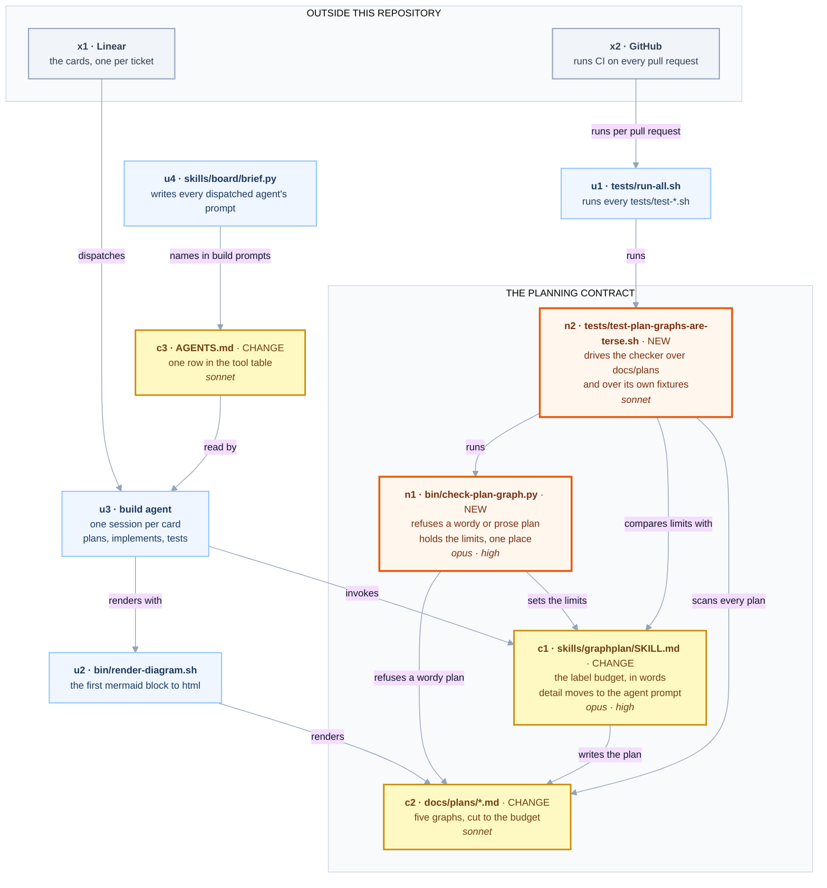

```mermaid
%%{init: {
  "theme": "base",
  "themeVariables": {
    "fontFamily": "Arial, Helvetica, sans-serif",
    "fontSize": "13px",
    "lineColor": "#94a3b8",
    "primaryTextColor": "#0f172a",
    "clusterBkg": "#f8fafc",
    "clusterBorder": "#cbd5e1"
  },
  "flowchart": { "curve": "basis", "nodeSpacing": 40, "rankSpacing": 60, "padding": 14 }
}}%%
flowchart TD

  subgraph OUT["OUTSIDE THIS REPOSITORY"]
    direction LR
    x1["<b>x1 · Linear</b><br/>the cards, one per ticket"]
    x2["<b>x2 · GitHub</b><br/>runs CI on every pull request"]
  end

  subgraph CONTRACT["THE PLANNING CONTRACT"]
    direction TB
    n1["<b>n1 · bin/check-plan-graph.py</b> · NEW<br/>refuses a wordy or prose plan<br/>holds the limits, one place<br/><i>opus · high</i>"]
    c1["<b>c1 · skills/graphplan/SKILL.md</b> · CHANGE<br/>the label budget, in words<br/>detail moves to the agent prompt<br/><i>opus · high</i>"]
    c2["<b>c2 · docs/plans/*.md</b> · CHANGE<br/>five graphs, cut to the budget<br/><i>sonnet</i>"]
    n2["<b>n2 · tests/test-plan-graphs-are-terse.sh</b> · NEW<br/>drives the checker over docs/plans<br/>and over its own fixtures<br/><i>sonnet</i>"]
  end

  c3["<b>c3 · AGENTS.md</b> · CHANGE<br/>one row in the tool table<br/><i>sonnet</i>"]
  u1["<b>u1 · tests/run-all.sh</b><br/>runs every tests/test-*.sh"]
  u2["<b>u2 · bin/render-diagram.sh</b><br/>the first mermaid block to html"]
  u3["<b>u3 · build agent</b><br/>one session per card<br/>plans, implements, tests"]
  u4["<b>u4 · skills/board/brief.py</b><br/>writes every dispatched agent's prompt"]

  x1 -->|dispatches| u3
  u3 -->|invokes| c1
  c1 -->|writes the plan| c2
  n1 -->|refuses a wordy plan| c2
  n1 -->|sets the limits| c1
  n2 -->|runs| n1
  n2 -->|compares limits with| c1
  n2 -->|scans every plan| c2
  u1 -->|runs| n2
  x2 -->|runs per pull request| u1
  u3 -->|renders with| u2
  u2 -->|renders| c2
  u4 -->|names in build prompts| c3
  c3 -->|read by| u3

  classDef new  fill:#fff7ed,stroke:#ea580c,stroke-width:2.5px,color:#7c2d12
  classDef chg  fill:#fef9c3,stroke:#ca8a04,stroke-width:2px,color:#713f12
  classDef same fill:#eff6ff,stroke:#93c5fd,stroke-width:1.5px,color:#1e3a5f
  classDef ext  fill:#f1f5f9,stroke:#94a3b8,stroke-width:1.5px,color:#334155

  class n1,n2 new
  class c1,c2,c3 chg
  class u1,u2,u3,u4 same
  class x1,x2 ext
```
