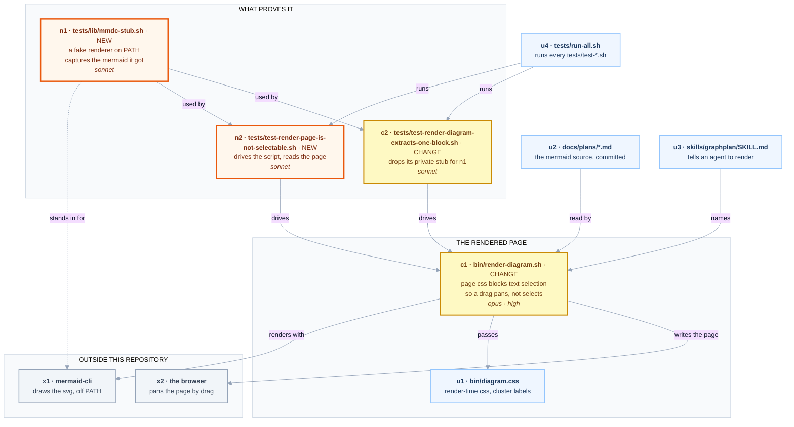

```mermaid
%%{init: {
  "theme": "base",
  "themeVariables": {
    "fontFamily": "Arial, Helvetica, sans-serif",
    "fontSize": "13px",
    "lineColor": "#94a3b8",
    "primaryTextColor": "#0f172a",
    "clusterBkg": "#f8fafc",
    "clusterBorder": "#cbd5e1"
  },
  "flowchart": { "curve": "basis", "nodeSpacing": 40, "rankSpacing": 60, "padding": 14 }
}}%%
flowchart TD

  subgraph OUT["OUTSIDE THIS REPOSITORY"]
    direction LR
    x1["<b>x1 · mermaid-cli</b><br/>draws the svg, off PATH"]
    x2["<b>x2 · the browser</b><br/>pans the page by drag"]
  end

  subgraph VIEW["THE RENDERED PAGE"]
    direction TB
    c1["<b>c1 · bin/render-diagram.sh</b> · CHANGE<br/>page css blocks text selection<br/>so a drag pans, not selects<br/><i>opus · high</i>"]
    u1["<b>u1 · bin/diagram.css</b><br/>render-time css, cluster labels"]
  end

  subgraph SUITE["WHAT PROVES IT"]
    direction TB
    n1["<b>n1 · tests/lib/mmdc-stub.sh</b> · NEW<br/>a fake renderer on PATH<br/>captures the mermaid it got<br/><i>sonnet</i>"]
    n2["<b>n2 · tests/test-render-page-is-not-selectable.sh</b> · NEW<br/>drives the script, reads the page<br/><i>sonnet</i>"]
    c2["<b>c2 · tests/test-render-diagram-extracts-one-block.sh</b> · CHANGE<br/>drops its private stub for n1<br/><i>sonnet</i>"]
  end

  u2["<b>u2 · docs/plans/*.md</b><br/>the mermaid source, committed"]
  u3["<b>u3 · skills/graphplan/SKILL.md</b><br/>tells an agent to render"]
  u4["<b>u4 · tests/run-all.sh</b><br/>runs every tests/test-*.sh"]

  u2 -->|read by| c1
  u3 -->|names| c1
  c1 -->|renders with| x1
  c1 -->|passes| u1
  c1 -->|writes the page| x2
  n1 -.->|stands in for| x1
  n1 -->|used by| n2
  n1 -->|used by| c2
  n2 -->|drives| c1
  c2 -->|drives| c1
  u4 -->|runs| n2
  u4 -->|runs| c2

  classDef new  fill:#fff7ed,stroke:#ea580c,stroke-width:2.5px,color:#7c2d12
  classDef chg  fill:#fef9c3,stroke:#ca8a04,stroke-width:2px,color:#713f12
  classDef same fill:#eff6ff,stroke:#93c5fd,stroke-width:1.5px,color:#1e3a5f
  classDef ext  fill:#f1f5f9,stroke:#94a3b8,stroke-width:1.5px,color:#334155

  class n1,n2 new
  class c1,c2 chg
  class u1,u2,u3,u4 same
  class x1,x2 ext
```
