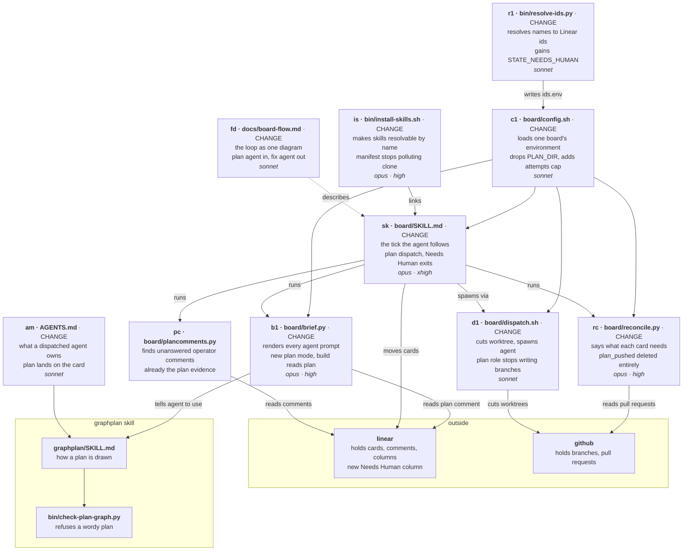

```mermaid
flowchart TD
    subgraph OUTSIDE[" outside "]
        lin["<b>linear</b><br/>holds cards, comments, columns<br/>new Needs Human column"]
        gh["<b>github</b><br/>holds branches, pull requests"]
    end

    subgraph SKILLS[" graphplan skill "]
        gp["<b>graphplan/SKILL.md</b><br/>how a plan is drawn"]
        cg["<b>bin/check-plan-graph.py</b><br/>refuses a wordy plan"]
    end

    r1["<b>r1 · bin/resolve-ids.py</b> · CHANGE<br/>resolves names to Linear ids<br/>gains STATE_NEEDS_HUMAN<br/><i>sonnet</i>"]
    c1["<b>c1 · board/config.sh</b> · CHANGE<br/>loads one board's environment<br/>drops PLAN_DIR, adds attempts cap<br/><i>sonnet</i>"]
    b1["<b>b1 · board/brief.py</b> · CHANGE<br/>renders every agent prompt<br/>new plan mode, build reads plan<br/><i>opus · high</i>"]
    d1["<b>d1 · board/dispatch.sh</b> · CHANGE<br/>cuts worktree, spawns agent<br/>plan role stops writing branches<br/><i>sonnet</i>"]
    rc["<b>rc · board/reconcile.py</b> · CHANGE<br/>says what each card needs<br/>plan_pushed deleted entirely<br/><i>opus · high</i>"]
    pc["<b>pc · board/plancomments.py</b><br/>finds unanswered operator comments<br/>already the plan evidence"]
    sk["<b>sk · board/SKILL.md</b> · CHANGE<br/>the tick the agent follows<br/>plan dispatch, Needs Human exits<br/><i>opus · xhigh</i>"]
    am["<b>am · AGENTS.md</b> · CHANGE<br/>what a dispatched agent owns<br/>plan lands on the card<br/><i>sonnet</i>"]
    fd["<b>fd · docs/board-flow.md</b> · CHANGE<br/>the loop as one diagram<br/>plan agent in, fix agent out<br/><i>sonnet</i>"]
    is["<b>is · bin/install-skills.sh</b> · CHANGE<br/>makes skills resolvable by name<br/>manifest stops polluting clone<br/><i>opus · high</i>"]

    r1 -->|"writes ids.env"| c1
    c1 --> b1
    c1 --> d1
    c1 --> rc
    c1 --> sk
    sk -->|"runs"| rc
    sk -->|"runs"| b1
    sk -->|"runs"| pc
    sk -->|"spawns via"| d1
    b1 -->|"reads plan comment"| lin
    sk -->|"moves cards"| lin
    pc -->|"reads comments"| lin
    rc -->|"reads pull requests"| gh
    d1 -->|"cuts worktrees"| gh
    b1 -->|"tells agent to use"| gp
    gp --> cg
    am --> gp
    is -->|"links"| sk
    fd -.->|"describes"| sk
```
