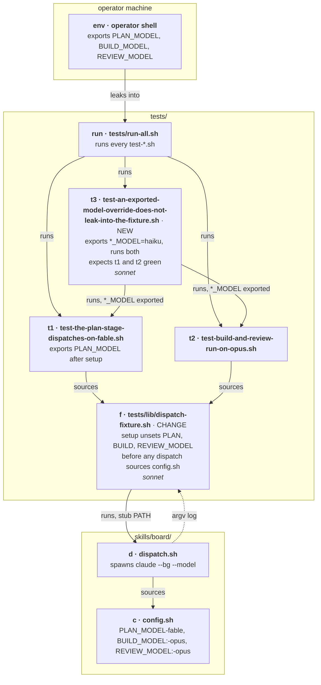

```mermaid
flowchart TD
  subgraph host["operator machine"]
    env["<b>env · operator shell</b><br/>exports PLAN_MODEL, BUILD_MODEL, REVIEW_MODEL"]
  end

  subgraph tests["tests/"]
    t3["<b>t3 · test-an-exported-model-override-does-not-leak-into-the-fixture.sh</b> · NEW<br/>exports *_MODEL=haiku, runs both<br/>expects t1 and t2 green<br/><i>sonnet</i>"]
    t1["<b>t1 · test-the-plan-stage-dispatches-on-fable.sh</b><br/>exports PLAN_MODEL after setup"]
    t2["<b>t2 · test-build-and-review-run-on-opus.sh</b>"]
    f["<b>f · tests/lib/dispatch-fixture.sh</b> · CHANGE<br/>setup unsets PLAN, BUILD, REVIEW_MODEL<br/>before any dispatch sources config.sh<br/><i>sonnet</i>"]
    run["<b>run · tests/run-all.sh</b><br/>runs every test-*.sh"]
  end

  subgraph board["skills/board/"]
    d["<b>d · dispatch.sh</b><br/>spawns claude --bg --model"]
    c["<b>c · config.sh</b><br/>PLAN_MODEL-fable, BUILD_MODEL:-opus, REVIEW_MODEL:-opus"]
  end

  env -->|"leaks into"| run
  run -->|"runs"| t3
  run -->|"runs"| t1
  run -->|"runs"| t2
  t3 -->|"runs, *_MODEL exported"| t1
  t3 -->|"runs, *_MODEL exported"| t2
  t1 -->|"sources"| f
  t2 -->|"sources"| f
  f -->|"runs, stub PATH"| d
  d -->|"sources"| c
  d -.->|"argv log"| f
```
