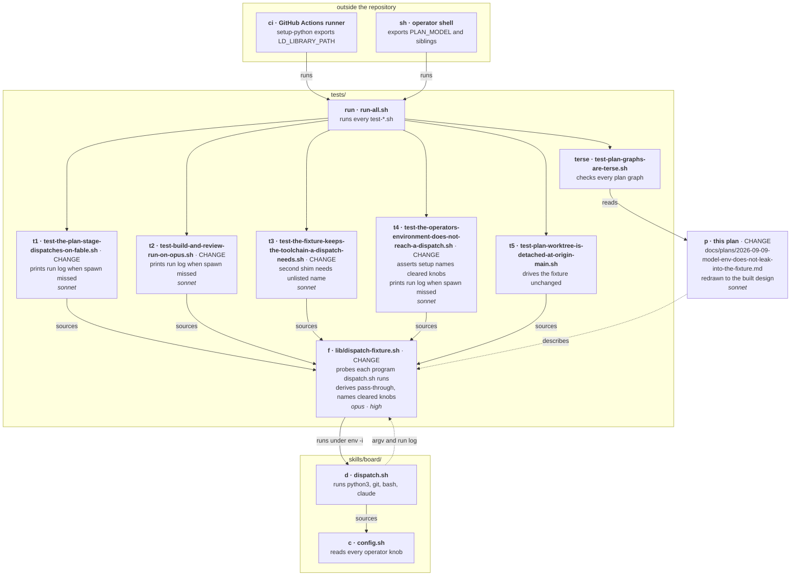

```mermaid
flowchart TD
  subgraph outside["outside the repository"]
    ci["<b>ci · GitHub Actions runner</b><br/>setup-python exports LD_LIBRARY_PATH"]
    sh["<b>sh · operator shell</b><br/>exports PLAN_MODEL and siblings"]
  end

  subgraph tests["tests/"]
    run["<b>run · run-all.sh</b><br/>runs every test-*.sh"]
    f["<b>f · lib/dispatch-fixture.sh</b> · CHANGE<br/>probes each program dispatch.sh runs<br/>derives pass-through, names cleared knobs<br/><i>opus · high</i>"]
    t1["<b>t1 · test-the-plan-stage-dispatches-on-fable.sh</b> · CHANGE<br/>prints run log when spawn missed<br/><i>sonnet</i>"]
    t2["<b>t2 · test-build-and-review-run-on-opus.sh</b> · CHANGE<br/>prints run log when spawn missed<br/><i>sonnet</i>"]
    t3["<b>t3 · test-the-fixture-keeps-the-toolchain-a-dispatch-needs.sh</b> · CHANGE<br/>second shim needs unlisted name<br/><i>sonnet</i>"]
    t4["<b>t4 · test-the-operators-environment-does-not-reach-a-dispatch.sh</b> · CHANGE<br/>asserts setup names cleared knobs<br/>prints run log when spawn missed<br/><i>sonnet</i>"]
    t5["<b>t5 · test-plan-worktree-is-detached-at-origin-main.sh</b><br/>drives the fixture unchanged"]
    terse["<b>terse · test-plan-graphs-are-terse.sh</b><br/>checks every plan graph"]
  end

  subgraph board["skills/board/"]
    d["<b>d · dispatch.sh</b><br/>runs python3, git, bash, claude"]
    c["<b>c · config.sh</b><br/>reads every operator knob"]
  end

  p["<b>p · this plan</b> · CHANGE<br/>docs/plans/2026-09-09-model-env-does-not-leak-into-the-fixture.md<br/>redrawn to the built design<br/><i>sonnet</i>"]

  ci -->|"runs"| run
  sh -->|"runs"| run
  run --> t1
  run --> t2
  run --> t3
  run --> t4
  run --> t5
  run --> terse
  t1 -->|"sources"| f
  t2 -->|"sources"| f
  t3 -->|"sources"| f
  t4 -->|"sources"| f
  t5 -->|"sources"| f
  f -->|"runs under env -i"| d
  d -->|"sources"| c
  d -.->|"argv and run log"| f
  terse -->|"reads"| p
  p -.->|"describes"| f
```
