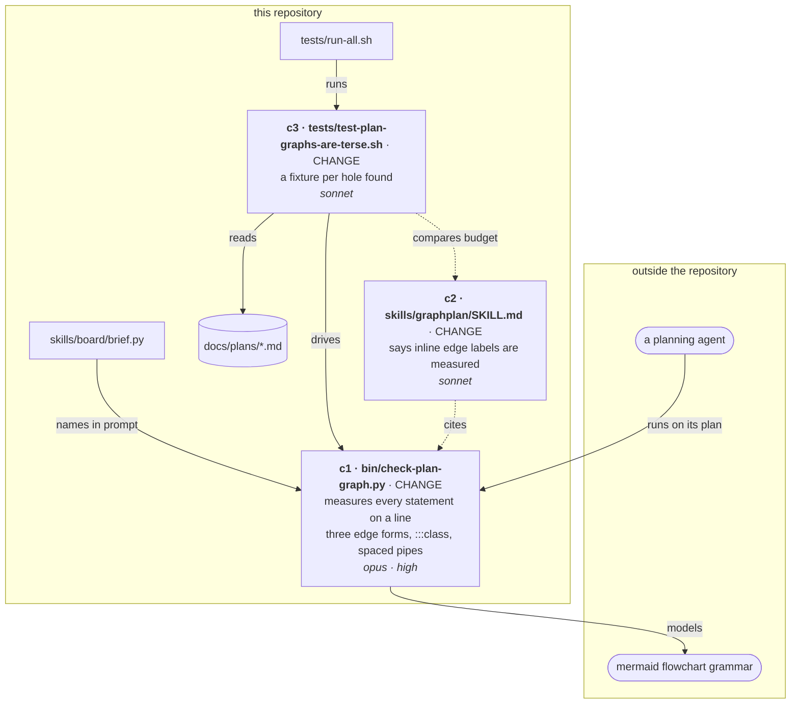

```mermaid
flowchart TD
  subgraph outside["outside the repository"]
    grammar(["mermaid flowchart grammar"])
    planner(["a planning agent"])
  end
  subgraph repo["this repository"]
    checker["<b>c1 · bin/check-plan-graph.py</b> · CHANGE<br/>measures every statement on a line<br/>three edge forms, :::class, spaced pipes<br/><i>opus · high</i>"]
    skill["<b>c2 · skills/graphplan/SKILL.md</b> · CHANGE<br/>says inline edge labels are measured<br/><i>sonnet</i>"]
    test["<b>c3 · tests/test-plan-graphs-are-terse.sh</b> · CHANGE<br/>a fixture per hole found<br/><i>sonnet</i>"]
    plans[("docs/plans/*.md")]
    runall["tests/run-all.sh"]
    brief["skills/board/brief.py"]
  end
  checker -->|models| grammar
  planner -->|"runs on its plan"| checker
  brief -->|"names in prompt"| checker
  test -->|drives| checker
  test -->|reads| plans
  test -.->|"compares budget"| skill
  skill -.->|cites| checker
  runall -->|runs| test
```
