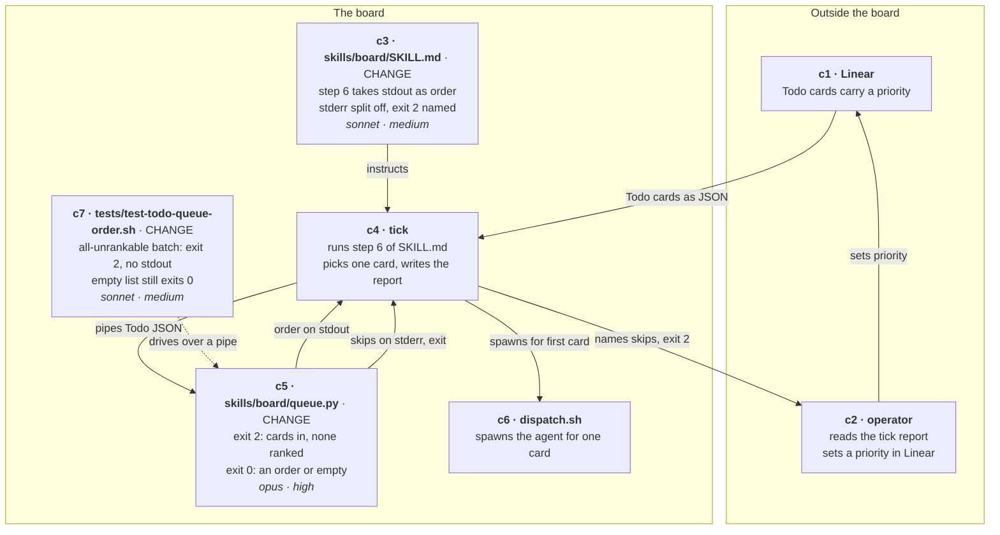

```mermaid
graph TD
  subgraph outside["Outside the board"]
    linear["<b>c1 · Linear</b><br/>Todo cards carry a priority"]
    operator["<b>c2 · operator</b><br/>reads the tick report<br/>sets a priority in Linear"]
  end
  subgraph board["The board"]
    skill["<b>c3 · skills/board/SKILL.md</b> · CHANGE<br/>step 6 takes stdout as order<br/>stderr split off, exit 2 named<br/><i>sonnet · medium</i>"]
    tick["<b>c4 · tick</b><br/>runs step 6 of SKILL.md<br/>picks one card, writes the report"]
    queue["<b>c5 · skills/board/queue.py</b> · CHANGE<br/>exit 2: cards in, none ranked<br/>exit 0: an order or empty<br/><i>opus · high</i>"]
    dispatch["<b>c6 · dispatch.sh</b><br/>spawns the agent for one card"]
    test["<b>c7 · tests/test-todo-queue-order.sh</b> · CHANGE<br/>all-unrankable batch: exit 2, no stdout<br/>empty list still exits 0<br/><i>sonnet · medium</i>"]
  end
  linear -->|"Todo cards as JSON"| tick
  skill -->|"instructs"| tick
  tick -->|"pipes Todo JSON"| queue
  queue -->|"order on stdout"| tick
  queue -->|"skips on stderr, exit"| tick
  tick -->|"spawns for first card"| dispatch
  tick -->|"names skips, exit 2"| operator
  operator -->|"sets priority"| linear
  test -.->|"drives over a pipe"| queue
```
