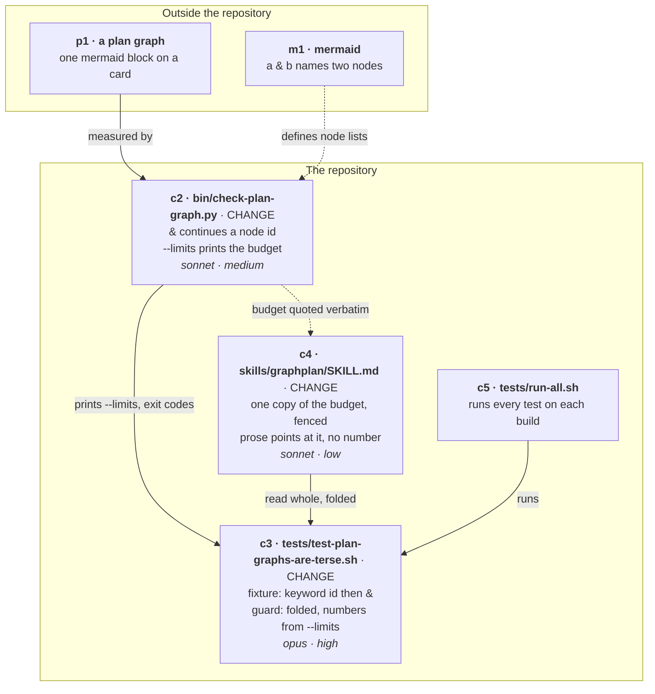

```mermaid
graph TD
  subgraph outside["Outside the repository"]
    p1["<b>p1 · a plan graph</b><br/>one mermaid block on a card"]
    m1["<b>m1 · mermaid</b><br/>a & b names two nodes"]
  end
  subgraph repo["The repository"]
    c2["<b>c2 · bin/check-plan-graph.py</b> · CHANGE<br/>& continues a node id<br/>--limits prints the budget<br/><i>sonnet · medium</i>"]
    c3["<b>c3 · tests/test-plan-graphs-are-terse.sh</b> · CHANGE<br/>fixture: keyword id then &<br/>guard: folded, numbers from --limits<br/><i>opus · high</i>"]
    c4["<b>c4 · skills/graphplan/SKILL.md</b> · CHANGE<br/>one copy of the budget, fenced<br/>prose points at it, no number<br/><i>sonnet · low</i>"]
    c5["<b>c5 · tests/run-all.sh</b><br/>runs every test on each build"]
  end
  p1 -->|"measured by"| c2
  m1 -.->|"defines node lists"| c2
  c2 -->|"prints --limits, exit codes"| c3
  c4 -->|"read whole, folded"| c3
  c2 -.->|"budget quoted verbatim"| c4
  c5 -->|"runs"| c3
```
