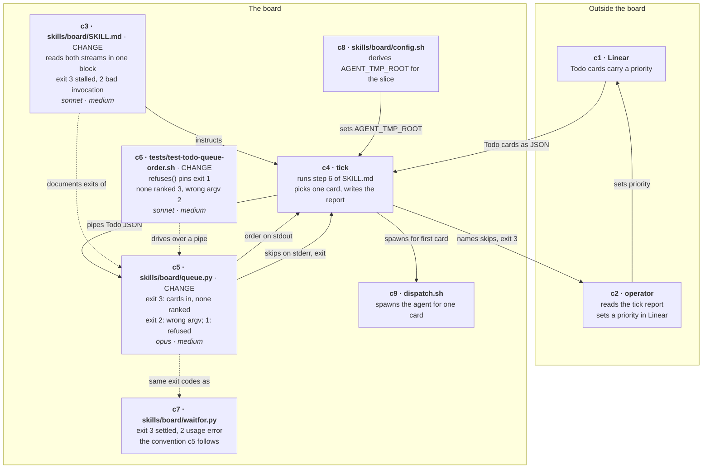

```mermaid
graph TD
  subgraph outside["Outside the board"]
    c1["<b>c1 · Linear</b><br/>Todo cards carry a priority"]
    c2["<b>c2 · operator</b><br/>reads the tick report<br/>sets a priority in Linear"]
  end
  subgraph board["The board"]
    c3["<b>c3 · skills/board/SKILL.md</b> · CHANGE<br/>reads both streams in one block<br/>exit 3 stalled, 2 bad invocation<br/><i>sonnet · medium</i>"]
    c4["<b>c4 · tick</b><br/>runs step 6 of SKILL.md<br/>picks one card, writes the report"]
    c5["<b>c5 · skills/board/queue.py</b> · CHANGE<br/>exit 3: cards in, none ranked<br/>exit 2: wrong argv; 1: refused<br/><i>opus · medium</i>"]
    c6["<b>c6 · tests/test-todo-queue-order.sh</b> · CHANGE<br/>refuses() pins exit 1<br/>none ranked 3, wrong argv 2<br/><i>sonnet · medium</i>"]
    c7["<b>c7 · skills/board/waitfor.py</b><br/>exit 3 settled, 2 usage error<br/>the convention c5 follows"]
    c8["<b>c8 · skills/board/config.sh</b><br/>derives AGENT_TMP_ROOT for the slice"]
    c9["<b>c9 · dispatch.sh</b><br/>spawns the agent for one card"]
  end
  c1 -->|"Todo cards as JSON"| c4
  c3 -->|"instructs"| c4
  c8 -->|"sets AGENT_TMP_ROOT"| c4
  c4 -->|"pipes Todo JSON"| c5
  c5 -->|"order on stdout"| c4
  c5 -->|"skips on stderr, exit"| c4
  c4 -->|"spawns for first card"| c9
  c4 -->|"names skips, exit 3"| c2
  c2 -->|"sets priority"| c1
  c3 -.->|"documents exits of"| c5
  c5 -.->|"same exit codes as"| c7
  c6 -.->|"drives over a pipe"| c5
```
