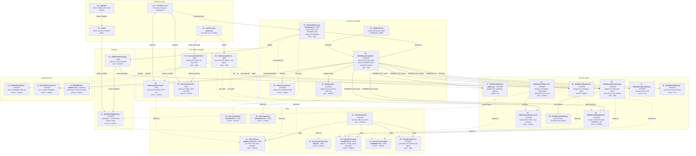

```mermaid
graph TD
  subgraph outside["Outside foreman"]
    o1["<b>o1 · Linear</b><br/>cards, columns, foreman labels"]
    o2["<b>o2 · operator</b><br/>clones, labels cards, runs migrate"]
    o3["<b>o3 · claude codex opencode</b><br/>the three CLIs on PATH"]
    o4["<b>o4 · ~/.foreman root</b><br/>linear.key, mcp.json, installations"]
  end
  subgraph loaders["Loaders and identity"]
    n1["<b>n1 · bin/installation.py, bin/install.sh</b> · NEW<br/>reads, writes, lists installation.toml<br/>refuses two defaults<br/><i>opus · high</i>"]
    n2["<b>n2 · skills/board/config.sh</b> · CHANGE<br/>derives home from path<br/>exports HARNESS_SH, installation names<br/><i>opus · high</i>"]
    n3["<b>n3 · bin/resolve-ids.py</b> · CHANGE<br/>creates the installation label<br/><i>sonnet · medium</i>"]
    n4["<b>n4 · bin/boards.py</b><br/>reads boards.toml under FOREMAN_HOME"]
    n5["<b>n5 · bin/boardctl</b> · CHANGE<br/>migrate moves a home under root<br/><i>opus · medium</i>"]
  end
  subgraph adapter["The harness adapter"]
    h1["<b>h1 · harness/claude.sh</b> · NEW<br/>five verbs over claude --bg, agents<br/><i>opus · high</i>"]
    h2["<b>h2 · harness/detached.sh</b> · NEW<br/>nohup, pid records, list, stop, loop<br/><i>opus · high</i>"]
    h3["<b>h3 · harness/codex.sh</b> · NEW<br/>codex exec flags, MCP overrides<br/><i>sonnet · medium</i>"]
    h4["<b>h4 · harness/opencode.sh</b> · NEW<br/>opencode run flags, MCP file<br/><i>sonnet · medium</i>"]
  end
  subgraph routing["Routing"]
    r1["<b>r1 · skills/board/route.py</b> · NEW<br/>owner of a card by label<br/><i>opus · medium</i>"]
    r2["<b>r2 · skills/board/queue.py</b> · CHANGE<br/>--installation, --default drop foreign cards<br/><i>sonnet · medium</i>"]
  end
  subgraph tick["The tick scripts"]
    t1["<b>t1 · skills/board/SKILL.md</b> · CHANGE<br/>liveness via adapter, routing flags<br/>label before the move<br/><i>opus · medium</i>"]
    t2["<b>t2 · skills/board/dispatch.sh</b> · CHANGE<br/>spawn, resume through HARNESS_SH<br/><i>sonnet · medium</i>"]
    t3["<b>t3 · skills/board/supervise.sh</b> · CHANGE<br/>tick spawned with --loop-minutes<br/><i>opus · medium</i>"]
    t4["<b>t4 · skills/board/reconcile.py</b> · CHANGE<br/>adapter list, transcript, prefix<br/>host slots across siblings<br/><i>opus · high</i>"]
    t5["<b>t5 · skills/board/watch-agents.py</b> · CHANGE<br/>adapter list, installation segment<br/><i>sonnet · low</i>"]
    t6["<b>t6 · skills/board/sweep.sh</b> · CHANGE<br/>adapter list, installation globs<br/><i>sonnet · medium</i>"]
    t7["<b>t7 · skills/board/preflight.py</b> · CHANGE<br/>harness check verb<br/><i>sonnet · low</i>"]
    t8["<b>t8 · skills/board/brief.py</b> · CHANGE<br/>names the harness limits<br/><i>sonnet · low</i>"]
    t9["<b>t9 · skills/board/waitfor.py</b><br/>polls through reconcile.load_agents"]
  end
  subgraph install["Install and docs"]
    i1["<b>i1 · bin/install-skills.sh</b> · CHANGE<br/>links into adapter skills-dir<br/><i>sonnet · medium</i>"]
    i2["<b>i2 · bin/install-service.sh</b> · CHANGE<br/>one unit per installation<br/><i>sonnet · medium</i>"]
    i3["<b>i3 · README.md, AGENTS.md</b> · CHANGE<br/>root layout, install.sh, labels<br/><i>sonnet · medium</i>"]
  end
  subgraph tests["Tests"]
    s1["<b>s1 · tests/lib fixtures</b> · CHANGE<br/>harness stub, root layout<br/><i>opus · medium</i>"]
    s2["<b>s2 · test-harness-adapters-agree.sh</b> · NEW<br/>one verb script, three adapters<br/><i>opus · medium</i>"]
    s3["<b>s3 · test-queue-routes-by-label.sh</b> · NEW<br/><i>sonnet · medium</i>"]
    s4["<b>s4 · test-one-default-installation.sh</b> · NEW<br/><i>sonnet · medium</i>"]
    s5["<b>s5 · test-migrate-to-installations.sh</b> · NEW<br/><i>sonnet · medium</i>"]
    s6["<b>s6 · test-names-carry-installation.sh</b> · NEW<br/>dispatch, sweep, watch stay apart<br/><i>sonnet · medium</i>"]
    s7["<b>s7 · test-host-slots-span-installations.sh</b> · NEW<br/><i>sonnet · medium</i>"]
    s8["<b>s8 · existing tests/*.sh</b> · CHANGE<br/>assert the new names and layout<br/><i>opus · high</i>"]
  end
  o4 -->|"installation.toml"| n1
  n1 -->|"NUL pairs"| n2
  n4 -->|"NUL pairs"| n2
  n2 -->|"HARNESS_SH, names"| t2
  n2 -->|"HARNESS_SH, names"| t3
  n2 -->|"HARNESS_SH, names"| t4
  n2 -->|"HARNESS_SH, names"| t5
  n2 -->|"HARNESS_SH, names"| t6
  n2 -->|"HARNESS_SH"| t7
  n2 -->|"label id"| n3
  n1 -->|"siblings"| r1
  r1 -->|"owner predicate"| r2
  r1 -->|"owner predicate"| t4
  o1 -->|"cards as JSON"| r2
  o3 -->|"claude"| h1
  o3 -->|"codex, opencode"| h2
  h2 -->|"spawns, records"| h3
  h2 -->|"spawns, records"| h4
  o4 -->|"mcp.json"| h3
  o4 -->|"mcp.json"| h4
  h1 -.->|"five verbs"| t2
  h1 -.->|"five verbs"| t3
  h1 -.->|"list, transcript"| t4
  h1 -.->|"list"| t5
  h1 -.->|"list"| t6
  h1 -.->|"check"| t7
  h1 -.->|"skills-dir"| i1
  h1 -.->|"skills-dir"| i2
  t4 -->|"load_agents"| t9
  t1 -->|"instructs"| t3
  t1 -.->|"names flags of"| r2
  t1 -.->|"names verbs of"| t2
  n2 -->|"migrate target"| n5
  n2 -->|"unit per installation"| i2
  n2 -->|"brief facts"| t8
  n1 -.->|"documented by"| i3
  s1 -->|"stubs"| s2
  s1 -->|"stubs"| s6
  s1 -->|"stubs"| s7
  s1 -->|"stubs"| s8
  h1 -.->|"driven by"| s2
  h3 -.->|"driven by"| s2
  h4 -.->|"driven by"| s2
  r2 -.->|"driven by"| s3
  n1 -.->|"driven by"| s4
  n5 -.->|"driven by"| s5
  t2 -.->|"driven by"| s6
  t6 -.->|"driven by"| s6
  t5 -.->|"driven by"| s6
  t4 -.->|"driven by"| s7
  t1 -.->|"checked by"| s8
  o2 -->|"labels, migrates"| o1
```
