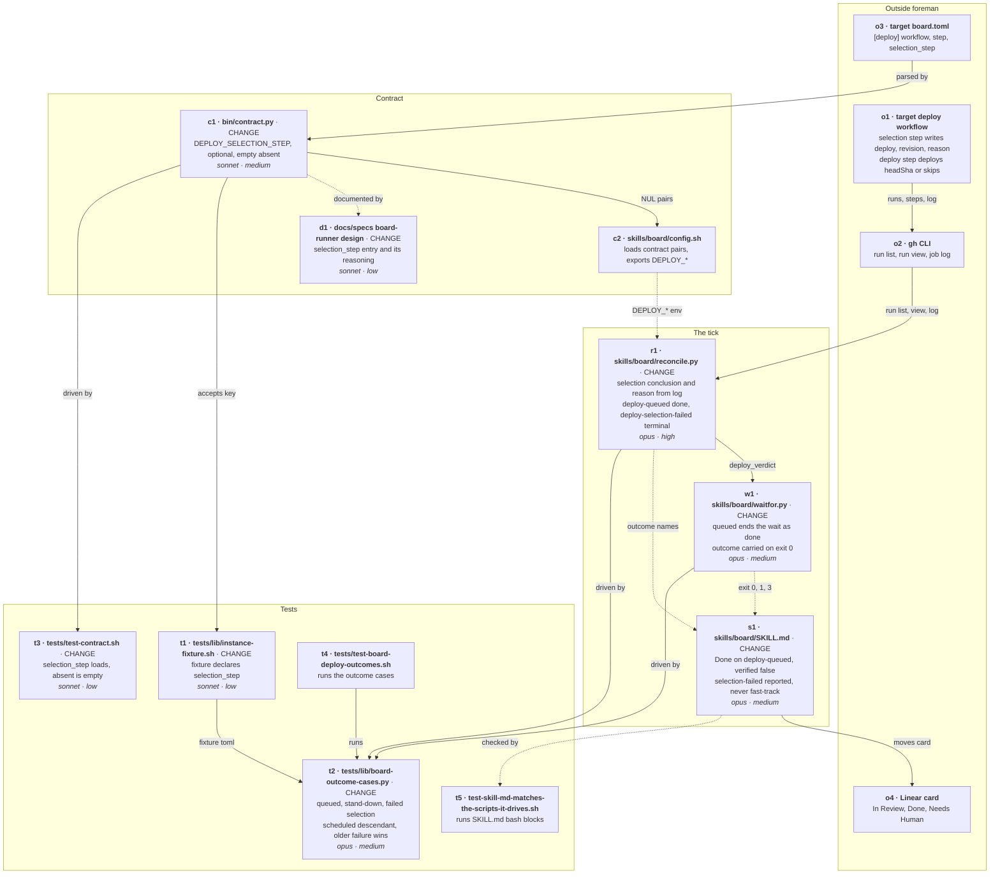

```mermaid
graph TD
  subgraph outside["Outside foreman"]
    o1["<b>o1 · target deploy workflow</b><br/>selection step writes deploy, revision, reason<br/>deploy step deploys headSha or skips"]
    o2["<b>o2 · gh CLI</b><br/>run list, run view, job log"]
    o3["<b>o3 · target board.toml</b><br/>[deploy] workflow, step, selection_step"]
    o4["<b>o4 · Linear card</b><br/>In Review, Done, Needs Human"]
  end
  subgraph contract["Contract"]
    c1["<b>c1 · bin/contract.py</b> · CHANGE<br/>DEPLOY_SELECTION_STEP, optional, empty absent<br/><i>sonnet · medium</i>"]
    c2["<b>c2 · skills/board/config.sh</b><br/>loads contract pairs, exports DEPLOY_*"]
    d1["<b>d1 · docs/specs board-runner design</b> · CHANGE<br/>selection_step entry and its reasoning<br/><i>sonnet · low</i>"]
  end
  subgraph tick["The tick"]
    r1["<b>r1 · skills/board/reconcile.py</b> · CHANGE<br/>selection conclusion and reason from log<br/>deploy-queued done, deploy-selection-failed terminal<br/><i>opus · high</i>"]
    w1["<b>w1 · skills/board/waitfor.py</b> · CHANGE<br/>queued ends the wait as done<br/>outcome carried on exit 0<br/><i>opus · medium</i>"]
    s1["<b>s1 · skills/board/SKILL.md</b> · CHANGE<br/>Done on deploy-queued, verified false<br/>selection-failed reported, never fast-track<br/><i>opus · medium</i>"]
  end
  subgraph tests["Tests"]
    t1["<b>t1 · tests/lib/instance-fixture.sh</b> · CHANGE<br/>fixture declares selection_step<br/><i>sonnet · low</i>"]
    t2["<b>t2 · tests/lib/board-outcome-cases.py</b> · CHANGE<br/>queued, stand-down, failed selection<br/>scheduled descendant, older failure wins<br/><i>opus · medium</i>"]
    t3["<b>t3 · tests/test-contract.sh</b> · CHANGE<br/>selection_step loads, absent is empty<br/><i>sonnet · low</i>"]
    t4["<b>t4 · tests/test-board-deploy-outcomes.sh</b><br/>runs the outcome cases"]
    t5["<b>t5 · test-skill-md-matches-the-scripts-it-drives.sh</b><br/>runs SKILL.md bash blocks"]
  end
  o3 -->|"parsed by"| c1
  c1 -->|"NUL pairs"| c2
  c2 -.->|"DEPLOY_* env"| r1
  o1 -->|"runs, steps, log"| o2
  o2 -->|"run list, view, log"| r1
  r1 -->|"deploy_verdict"| w1
  r1 -.->|"outcome names"| s1
  w1 -.->|"exit 0, 1, 3"| s1
  s1 -->|"moves card"| o4
  c1 -.->|"documented by"| d1
  c1 -->|"accepts key"| t1
  c1 -->|"driven by"| t3
  t1 -->|"fixture toml"| t2
  r1 -->|"driven by"| t2
  w1 -->|"driven by"| t2
  t4 -->|"runs"| t2
  s1 -.->|"checked by"| t5
```
