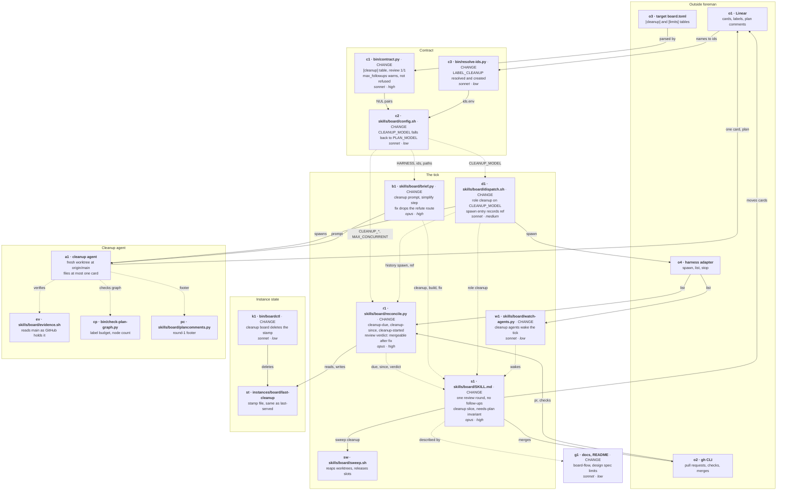

```mermaid
graph TD
  subgraph outside["Outside foreman"]
    o1["<b>o1 · Linear</b><br/>cards, labels, plan comments"]
    o2["<b>o2 · gh CLI</b><br/>pull requests, checks, merges"]
    o3["<b>o3 · target board.toml</b><br/>[cleanup] and [limits] tables"]
    o4["<b>o4 · harness adapter</b><br/>spawn, list, stop"]
  end
  subgraph contract["Contract"]
    c1["<b>c1 · bin/contract.py</b> · CHANGE<br/>[cleanup] table, review 1/1<br/>max_followups warns, not refused<br/><i>sonnet · high</i>"]
    c2["<b>c2 · skills/board/config.sh</b> · CHANGE<br/>CLEANUP_MODEL falls back to PLAN_MODEL<br/><i>sonnet · low</i>"]
    c3["<b>c3 · bin/resolve-ids.py</b> · CHANGE<br/>LABEL_CLEANUP resolved and created<br/><i>sonnet · low</i>"]
  end
  subgraph tick["The tick"]
    r1["<b>r1 · skills/board/reconcile.py</b> · CHANGE<br/>cleanup-due, cleanup-since, cleanup-started<br/>review verdict: mergeable after fix<br/><i>opus · high</i>"]
    d1["<b>d1 · skills/board/dispatch.sh</b> · CHANGE<br/>role cleanup on CLEANUP_MODEL<br/>spawn entry records ref<br/><i>sonnet · medium</i>"]
    b1["<b>b1 · skills/board/brief.py</b> · CHANGE<br/>cleanup prompt, simplify step<br/>fix drops the refute route<br/><i>opus · high</i>"]
    w1["<b>w1 · skills/board/watch-agents.py</b> · CHANGE<br/>cleanup agents wake the tick<br/><i>sonnet · low</i>"]
    s1["<b>s1 · skills/board/SKILL.md</b> · CHANGE<br/>one review round, no follow-ups<br/>cleanup slice, needs-plan invariant<br/><i>opus · high</i>"]
    sw["<b>sw · skills/board/sweep.sh</b><br/>reaps worktrees, releases slots"]
  end
  subgraph state["Instance state"]
    st["<b>st · instances/board/last-cleanup</b><br/>stamp file, same as last-served"]
    k1["<b>k1 · bin/boardctl</b> · CHANGE<br/>cleanup board deletes the stamp<br/><i>sonnet · low</i>"]
  end
  subgraph agent["Cleanup agent"]
    a1["<b>a1 · cleanup agent</b><br/>fresh worktree at origin/main<br/>files at most one card"]
    ev["<b>ev · skills/board/evidence.sh</b><br/>reads main as GitHub holds it"]
    cp["<b>cp · bin/check-plan-graph.py</b><br/>label budget, node count"]
    pc["<b>pc · skills/board/plancomments.py</b><br/>round-1 footer"]
  end
  g1["<b>g1 · docs, README</b> · CHANGE<br/>board-flow, design spec limits<br/><i>sonnet · low</i>"]

  o3 -->|"parsed by"| c1
  c1 -->|"NUL pairs"| c2
  o1 -->|"names to ids"| c3
  c3 -->|"ids.env"| c2
  c2 -.->|"CLEANUP_*, MAX_CONCURRENT"| r1
  c2 -.->|"CLEANUP_MODEL"| d1
  c2 -.->|"HARNESS, ids, paths"| b1
  o4 -->|"list"| r1
  o4 -->|"list"| w1
  o2 -->|"pr, checks"| r1
  d1 -->|"spawn"| o4
  d1 -.->|"history spawn, ref"| r1
  r1 -->|"reads, writes"| st
  k1 -->|"deletes"| st
  r1 -.->|"due, since, verdict"| s1
  b1 -.->|"cleanup, build, fix"| s1
  d1 -.->|"role cleanup"| s1
  w1 -.->|"wakes"| s1
  s1 -->|"moves cards"| o1
  s1 -->|"merges"| o2
  s1 -->|"sweep cleanup"| sw
  d1 -->|"spawns"| a1
  b1 -->|"prompt"| a1
  a1 -->|"one card, plan"| o1
  a1 -.->|"verifies"| ev
  a1 -.->|"checks graph"| cp
  a1 -.->|"footer"| pc
  s1 -.->|"described by"| g1
```
