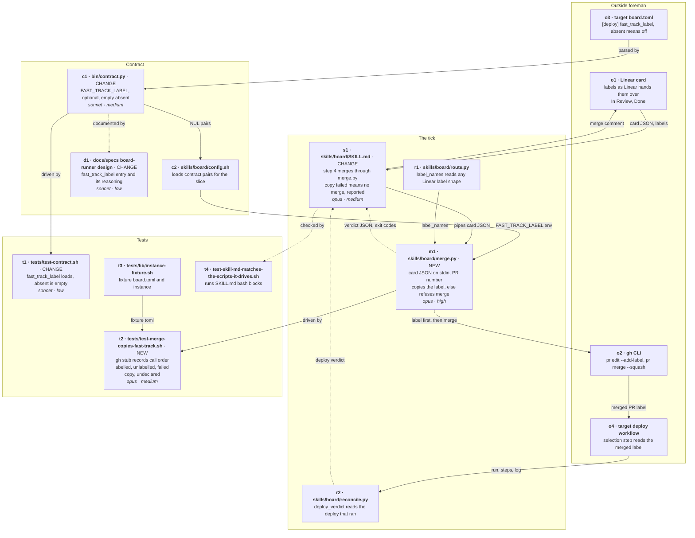

```mermaid
graph TD
  subgraph outside["Outside foreman"]
    o1["<b>o1 · Linear card</b><br/>labels as Linear hands them over<br/>In Review, Done"]
    o2["<b>o2 · gh CLI</b><br/>pr edit --add-label, pr merge --squash"]
    o3["<b>o3 · target board.toml</b><br/>[deploy] fast_track_label, absent means off"]
    o4["<b>o4 · target deploy workflow</b><br/>selection step reads the merged label"]
  end
  subgraph contract["Contract"]
    c1["<b>c1 · bin/contract.py</b> · CHANGE<br/>FAST_TRACK_LABEL, optional, empty absent<br/><i>sonnet · medium</i>"]
    c2["<b>c2 · skills/board/config.sh</b><br/>loads contract pairs for the slice"]
    d1["<b>d1 · docs/specs board-runner design</b> · CHANGE<br/>fast_track_label entry and its reasoning<br/><i>sonnet · low</i>"]
  end
  subgraph tick["The tick"]
    m1["<b>m1 · skills/board/merge.py</b> · NEW<br/>card JSON on stdin, PR number<br/>copies the label, else refuses merge<br/><i>opus · high</i>"]
    r1["<b>r1 · skills/board/route.py</b><br/>label_names reads any Linear label shape"]
    r2["<b>r2 · skills/board/reconcile.py</b><br/>deploy_verdict reads the deploy that ran"]
    s1["<b>s1 · skills/board/SKILL.md</b> · CHANGE<br/>step 4 merges through merge.py<br/>copy failed means no merge, reported<br/><i>opus · medium</i>"]
  end
  subgraph tests["Tests"]
    t1["<b>t1 · tests/test-contract.sh</b> · CHANGE<br/>fast_track_label loads, absent is empty<br/><i>sonnet · low</i>"]
    t2["<b>t2 · tests/test-merge-copies-fast-track.sh</b> · NEW<br/>gh stub records call order<br/>labelled, unlabelled, failed copy, undeclared<br/><i>opus · medium</i>"]
    t3["<b>t3 · tests/lib/instance-fixture.sh</b><br/>fixture board.toml and instance"]
    t4["<b>t4 · test-skill-md-matches-the-scripts-it-drives.sh</b><br/>runs SKILL.md bash blocks"]
  end
  o3 -->|"parsed by"| c1
  c1 -->|"NUL pairs"| c2
  c2 -->|"FAST_TRACK_LABEL env"| m1
  o1 -->|"card JSON, labels"| s1
  s1 -->|"pipes card JSON"| m1
  r1 -->|"label_names"| m1
  m1 -->|"label first, then merge"| o2
  m1 -.->|"verdict JSON, exit codes"| s1
  o2 -->|"merged PR label"| o4
  o4 -->|"run, steps, log"| r2
  r2 -.->|"deploy verdict"| s1
  s1 -->|"merge comment"| o1
  c1 -.->|"documented by"| d1
  c1 -->|"driven by"| t1
  m1 -->|"driven by"| t2
  t3 -->|"fixture toml"| t2
  s1 -.->|"checked by"| t4
```
