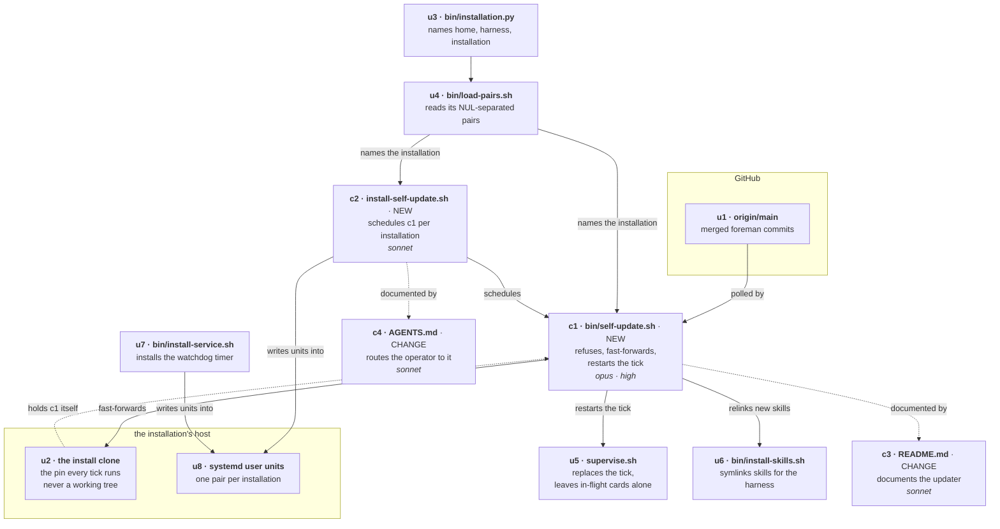

```mermaid
flowchart TD
  subgraph gh["GitHub"]
    u1["<b>u1 · origin/main</b><br/>merged foreman commits"]
  end

  subgraph host["the installation's host"]
    u2["<b>u2 · the install clone</b><br/>the pin every tick runs<br/>never a working tree"]
    u8["<b>u8 · systemd user units</b><br/>one pair per installation"]
  end

  u3["<b>u3 · bin/installation.py</b><br/>names home, harness, installation"]
  u4["<b>u4 · bin/load-pairs.sh</b><br/>reads its NUL-separated pairs"]
  u5["<b>u5 · supervise.sh</b><br/>replaces the tick,<br/>leaves in-flight cards alone"]
  u6["<b>u6 · bin/install-skills.sh</b><br/>symlinks skills for the harness"]
  u7["<b>u7 · bin/install-service.sh</b><br/>installs the watchdog timer"]

  c1["<b>c1 · bin/self-update.sh</b> · NEW<br/>refuses, fast-forwards,<br/>restarts the tick<br/><i>opus · high</i>"]
  c2["<b>c2 · install-self-update.sh</b> · NEW<br/>schedules c1 per installation<br/><i>sonnet</i>"]
  c3["<b>c3 · README.md</b> · CHANGE<br/>documents the updater<br/><i>sonnet</i>"]
  c4["<b>c4 · AGENTS.md</b> · CHANGE<br/>routes the operator to it<br/><i>sonnet</i>"]

  u1 -->|"polled by"| c1
  u3 --> u4
  u4 -->|"names the installation"| c1
  u4 -->|"names the installation"| c2
  c1 -->|"fast-forwards"| u2
  c1 -->|"restarts the tick"| u5
  c1 -->|"relinks new skills"| u6
  c2 -->|"schedules"| c1
  c2 -->|"writes units into"| u8
  u7 -->|"writes units into"| u8
  u2 -.->|"holds c1 itself"| c1
  c1 -.->|"documented by"| c3
  c2 -.->|"documented by"| c4
```
