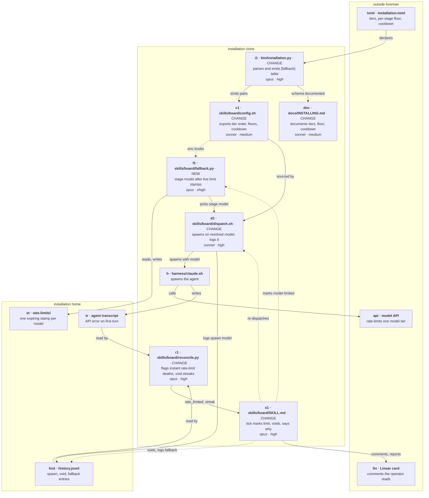

```mermaid
flowchart TD
  subgraph outside["outside foreman"]
    api["<b>api · model API</b><br/>rate-limits one model tier"]
    lin["<b>lin · Linear card</b><br/>comments the operator reads"]
    toml["<b>toml · installation.toml</b><br/>tiers, per-stage floor, cooldown"]
  end

  subgraph install["installation clone"]
    i1["<b>i1 · bin/installation.py</b> · CHANGE<br/>parses and emits [fallback] table<br/><i>opus · high</i>"]
    doc["<b>doc · docs/INSTALLING.md</b> · CHANGE<br/>documents tiers, floor, cooldown<br/><i>sonnet · medium</i>"]
    c1["<b>c1 · skills/board/config.sh</b> · CHANGE<br/>exports tier order, floors, cooldown<br/><i>sonnet · medium</i>"]
    f1["<b>f1 · skills/board/fallback.py</b> · NEW<br/>stage model after live limit stamps<br/><i>opus · xhigh</i>"]
    d1["<b>d1 · skills/board/dispatch.sh</b> · CHANGE<br/>spawns on resolved model, logs it<br/><i>sonnet · high</i>"]
    r1["<b>r1 · skills/board/reconcile.py</b> · CHANGE<br/>flags instant rate-limit deaths, void streaks<br/><i>opus · high</i>"]
    s1["<b>s1 · skills/board/SKILL.md</b> · CHANGE<br/>tick marks limit, voids, says why<br/><i>opus · high</i>"]
    h["<b>h · harness/claude.sh</b><br/>spawns the agent"]
  end

  subgraph state["installation home"]
    st["<b>st · rate-limits/</b><br/>one expiring stamp per model"]
    hist["<b>hist · history.jsonl</b><br/>spawn, void, fallback entries"]
    tr["<b>tr · agent transcript</b><br/>API error on first turn"]
  end

  toml -->|"declares"| i1
  i1 -->|"emits pairs"| c1
  i1 -->|"schema documented"| doc
  c1 -.->|"env knobs"| f1
  c1 -->|"sourced by"| d1
  f1 -->|"reads, writes"| st
  f1 -->|"picks stage model"| d1
  d1 -->|"spawns with model"| h
  d1 -->|"logs spawn model"| hist
  h -->|"calls"| api
  h -->|"writes"| tr
  tr -->|"read by"| r1
  hist -->|"read by"| r1
  r1 -->|"rate_limited, streak"| s1
  s1 -.->|"marks model limited"| f1
  s1 -.->|"re-dispatches"| d1
  s1 -.->|"voids, logs fallback"| hist
  s1 -->|"comments, reports"| lin
```
