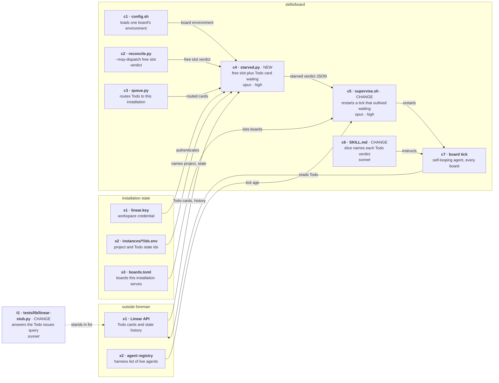

```mermaid
flowchart LR
  subgraph ext["outside foreman"]
    x1["<b>x1 · Linear API</b><br/>Todo cards and state history"]
    x2["<b>x2 · agent registry</b><br/>harness list of live agents"]
  end
  subgraph inst["installation state"]
    s1["<b>s1 · linear.key</b><br/>workspace credential"]
    s2["<b>s2 · instances/*/ids.env</b><br/>project and Todo state ids"]
    s3["<b>s3 · boards.toml</b><br/>boards this installation serves"]
  end
  subgraph board["skills/board"]
    c1["<b>c1 · config.sh</b><br/>loads one board's environment"]
    c2["<b>c2 · reconcile.py</b><br/>--may-dispatch free slot verdict"]
    c3["<b>c3 · queue.py</b><br/>routes Todo to this installation"]
    c4["<b>c4 · starved.py</b> · NEW<br/>free slot plus Todo card waiting<br/><i>opus · high</i>"]
    c5["<b>c5 · supervise.sh</b> · CHANGE<br/>restarts a tick that outlived waiting<br/><i>opus · high</i>"]
    c6["<b>c6 · SKILL.md</b> · CHANGE<br/>slice names each Todo verdict<br/><i>sonnet</i>"]
    c7["<b>c7 · board tick</b><br/>self-looping agent, every board"]
  end
  t1["<b>t1 · tests/lib/linear-stub.py</b> · CHANGE<br/>answers the Todo issues query<br/><i>sonnet</i>"]

  s1 -->|"authenticates"| c4
  s2 -->|"names project, state"| c4
  c1 -->|"board environment"| c4
  x1 -->|"Todo cards, history"| c4
  c2 -->|"free slot verdict"| c4
  c3 -->|"routed cards"| c4
  s3 -->|"lists boards"| c5
  x2 -->|"tick age"| c5
  c4 -->|"starved verdict JSON"| c5
  c5 -->|"restarts"| c7
  c6 -->|"instructs"| c7
  c7 -->|"reads Todo"| x1
  t1 -.->|"stands in for"| x1
```
