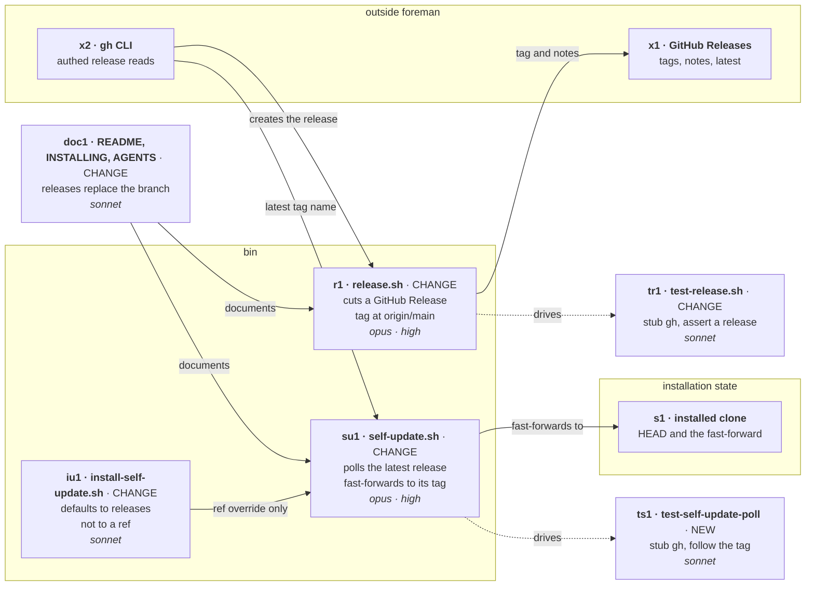

```mermaid
flowchart LR
  subgraph ext["outside foreman"]
    x1["<b>x1 · GitHub Releases</b><br/>tags, notes, latest"]
    x2["<b>x2 · gh CLI</b><br/>authed release reads"]
  end
  subgraph state["installation state"]
    s1["<b>s1 · installed clone</b><br/>HEAD and the fast-forward"]
  end
  subgraph bin["bin"]
    r1["<b>r1 · release.sh</b> · CHANGE<br/>cuts a GitHub Release<br/>tag at origin/main<br/><i>opus · high</i>"]
    su["<b>su1 · self-update.sh</b> · CHANGE<br/>polls the latest release<br/>fast-forwards to its tag<br/><i>opus · high</i>"]
    iu["<b>iu1 · install-self-update.sh</b> · CHANGE<br/>defaults to releases<br/>not to a ref<br/><i>sonnet</i>"]
  end
  tr["<b>tr1 · test-release.sh</b> · CHANGE<br/>stub gh, assert a release<br/><i>sonnet</i>"]
  ts["<b>ts1 · test-self-update-poll</b> · NEW<br/>stub gh, follow the tag<br/><i>sonnet</i>"]
  doc["<b>doc1 · README, INSTALLING, AGENTS</b> · CHANGE<br/>releases replace the branch<br/><i>sonnet</i>"]

  x2 -->|"creates the release"| r1
  r1 -->|"tag and notes"| x1
  x2 -->|"latest tag name"| su
  su -->|"fast-forwards to"| s1
  iu -->|"ref override only"| su
  r1 -.->|"drives"| tr
  su -.->|"drives"| ts
  doc -->|"documents"| r1
  doc -->|"documents"| su
```
