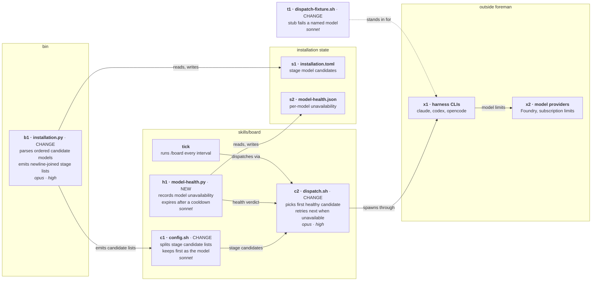

```mermaid
flowchart LR
  subgraph ext["outside foreman"]
    x1["<b>x1 · harness CLIs</b><br/>claude, codex, opencode"]
    x2["<b>x2 · model providers</b><br/>Foundry, subscription limits"]
  end
  subgraph state["installation state"]
    s1["<b>s1 · installation.toml</b><br/>stage model candidates"]
    s2["<b>s2 · model-health.json</b><br/>per-model unavailability"]
  end
  subgraph bin["bin"]
    b1["<b>b1 · installation.py</b> · CHANGE<br/>parses ordered candidate models<br/>emits newline-joined stage lists<br/><i>opus · high</i>"]
  end
  subgraph board["skills/board"]
    c1["<b>c1 · config.sh</b> · CHANGE<br/>splits stage candidate lists<br/>keeps first as the model<br/><i>sonnet</i>"]
    c2["<b>c2 · dispatch.sh</b> · CHANGE<br/>picks first healthy candidate<br/>retries next when unavailable<br/><i>opus · high</i>"]
    h1["<b>h1 · model-health.py</b> · NEW<br/>records model unavailability<br/>expires after a cooldown<br/><i>sonnet</i>"]
    tick["<b>tick</b><br/>runs /board every interval"]
  end
  t1["<b>t1 · dispatch-fixture.sh</b> · CHANGE<br/>stub fails a named model<br/><i>sonnet</i>"]

  b1 -->|"reads, writes"| s1
  b1 -->|"emits candidate lists"| c1
  c1 -->|"stage candidates"| c2
  h1 -->|"health verdict"| c2
  h1 -->|"reads, writes"| s2
  c2 -->|"spawns through"| x1
  x1 -->|"model limits"| x2
  tick -->|"dispatches via"| c2
  t1 -.->|"stands in for"| x1
```
