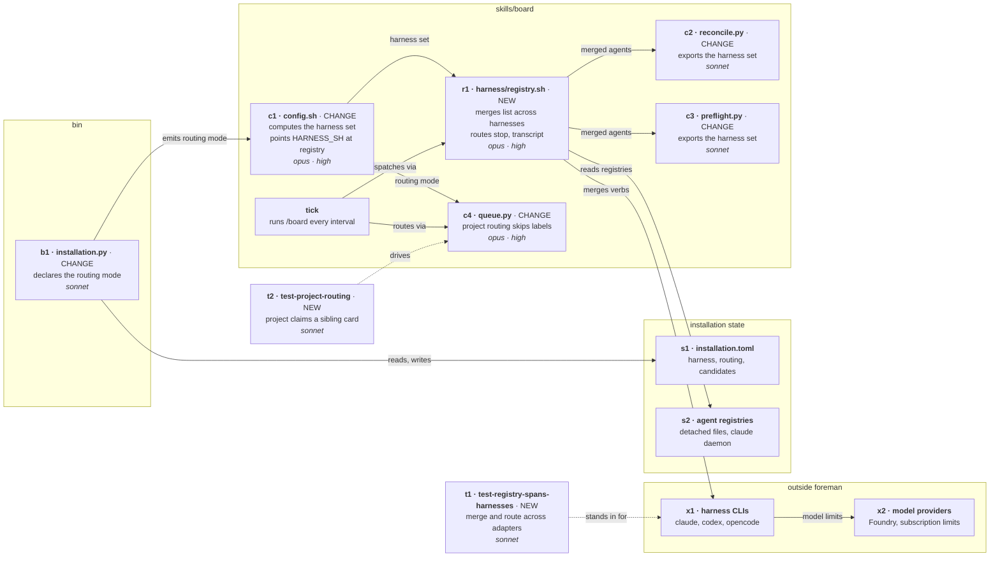

```mermaid
flowchart LR
  subgraph ext["outside foreman"]
    x1["<b>x1 · harness CLIs</b><br/>claude, codex, opencode"]
    x2["<b>x2 · model providers</b><br/>Foundry, subscription limits"]
  end
  subgraph state["installation state"]
    s1["<b>s1 · installation.toml</b><br/>harness, routing, candidates"]
    s2["<b>s2 · agent registries</b><br/>detached files, claude daemon"]
  end
  subgraph board["skills/board"]
    r1["<b>r1 · harness/registry.sh</b> · NEW<br/>merges list across harnesses<br/>routes stop, transcript<br/><i>opus · high</i>"]
    c1["<b>c1 · config.sh</b> · CHANGE<br/>computes the harness set<br/>points HARNESS_SH at registry<br/><i>opus · high</i>"]
    c2["<b>c2 · reconcile.py</b> · CHANGE<br/>exports the harness set<br/><i>sonnet</i>"]
    c3["<b>c3 · preflight.py</b> · CHANGE<br/>exports the harness set<br/><i>sonnet</i>"]
    c4["<b>c4 · queue.py</b> · CHANGE<br/>project routing skips labels<br/><i>opus · high</i>"]
    tick["<b>tick</b><br/>runs /board every interval"]
  end
  subgraph bin["bin"]
    b1["<b>b1 · installation.py</b> · CHANGE<br/>declares the routing mode<br/><i>sonnet</i>"]
  end
  t1["<b>t1 · test-registry-spans-harnesses</b> · NEW<br/>merge and route across adapters<br/><i>sonnet</i>"]
  t2["<b>t2 · test-project-routing</b> · NEW<br/>project claims a sibling card<br/><i>sonnet</i>"]

  b1 -->|"reads, writes"| s1
  b1 -->|"emits routing mode"| c1
  c1 -->|"harness set"| r1
  r1 -->|"merged agents"| c2
  r1 -->|"merged agents"| c3
  r1 -->|"reads registries"| s2
  r1 -->|"merges verbs"| x1
  x1 -->|"model limits"| x2
  c1 -->|"routing mode"| c4
  tick -->|"routes via"| c4
  tick -->|"dispatches via"| r1
  t1 -.->|"stands in for"| x1
  t2 -.->|"drives"| c4
```
