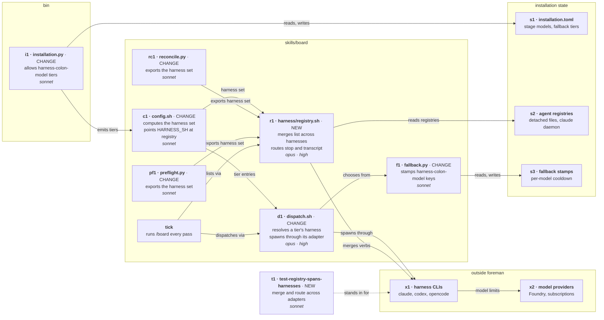

```mermaid
flowchart LR
  subgraph ext["outside foreman"]
    x1["<b>x1 · harness CLIs</b><br/>claude, codex, opencode"]
    x2["<b>x2 · model providers</b><br/>Foundry, subscriptions"]
  end
  subgraph state["installation state"]
    s1["<b>s1 · installation.toml</b><br/>stage models, fallback tiers"]
    s2["<b>s2 · agent registries</b><br/>detached files, claude daemon"]
    s3["<b>s3 · fallback stamps</b><br/>per-model cooldown"]
  end
  subgraph board["skills/board"]
    r1["<b>r1 · harness/registry.sh</b> · NEW<br/>merges list across harnesses<br/>routes stop and transcript<br/><i>opus · high</i>"]
    c1["<b>c1 · config.sh</b> · CHANGE<br/>computes the harness set<br/>points HARNESS_SH at registry<br/><i>sonnet</i>"]
    d1["<b>d1 · dispatch.sh</b> · CHANGE<br/>resolves a tier's harness<br/>spawns through its adapter<br/><i>opus · high</i>"]
    f1["<b>f1 · fallback.py</b> · CHANGE<br/>stamps harness-colon-model keys<br/><i>sonnet</i>"]
    rc["<b>rc1 · reconcile.py</b> · CHANGE<br/>exports the harness set<br/><i>sonnet</i>"]
    pf["<b>pf1 · preflight.py</b> · CHANGE<br/>exports the harness set<br/><i>sonnet</i>"]
    tick["<b>tick</b><br/>runs /board every pass"]
  end
  subgraph bin["bin"]
    i1["<b>i1 · installation.py</b> · CHANGE<br/>allows harness-colon-model tiers<br/><i>sonnet</i>"]
  end
  t1["<b>t1 · test-registry-spans-harnesses</b> · NEW<br/>merge and route across adapters<br/><i>sonnet</i>"]

  i1 -->|"reads, writes"| s1
  i1 -->|"emits tiers"| c1
  c1 -->|"harness set"| r1
  c1 -->|"tier entries"| d1
  d1 -->|"spawns through"| x1
  d1 -->|"chooses from"| f1
  f1 -->|"reads, writes"| s3
  r1 -->|"reads registries"| s2
  r1 -->|"merges verbs"| x1
  rc -->|"exports harness set"| r1
  pf -->|"exports harness set"| r1
  tick -->|"dispatches via"| d1
  tick -->|"lists via"| r1
  x1 -->|"model limits"| x2
  t1 -.->|"stands in for"| x1
```
