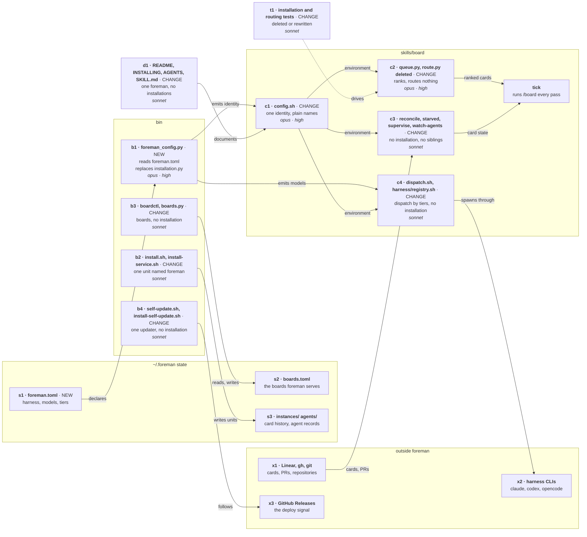

```mermaid
flowchart LR
  subgraph ext["outside foreman"]
    x1["<b>x1 · Linear, gh, git</b><br/>cards, PRs, repositories"]
    x2["<b>x2 · harness CLIs</b><br/>claude, codex, opencode"]
    x3["<b>x3 · GitHub Releases</b><br/>the deploy signal"]
  end
  subgraph state["~/.foreman state"]
    s1["<b>s1 · foreman.toml</b> · NEW<br/>harness, models, tiers"]
    s2["<b>s2 · boards.toml</b><br/>the boards foreman serves"]
    s3["<b>s3 · instances/ agents/</b><br/>card history, agent records"]
  end
  subgraph bin["bin"]
    b1["<b>b1 · foreman_config.py</b> · NEW<br/>reads foreman.toml<br/>replaces installation.py<br/><i>opus · high</i>"]
    b2["<b>b2 · install.sh, install-service.sh</b> · CHANGE<br/>one unit named foreman<br/><i>sonnet</i>"]
    b3["<b>b3 · boardctl, boards.py</b> · CHANGE<br/>boards, no installation<br/><i>sonnet</i>"]
    b4["<b>b4 · self-update.sh, install-self-update.sh</b> · CHANGE<br/>one updater, no installation<br/><i>sonnet</i>"]
  end
  subgraph board["skills/board"]
    c1["<b>c1 · config.sh</b> · CHANGE<br/>one identity, plain names<br/><i>opus · high</i>"]
    c2["<b>c2 · queue.py, route.py deleted</b> · CHANGE<br/>ranks, routes nothing<br/><i>opus · high</i>"]
    c3["<b>c3 · reconcile, starved, supervise, watch-agents</b> · CHANGE<br/>no installation, no siblings<br/><i>sonnet</i>"]
    c4["<b>c4 · dispatch.sh, harness/registry.sh</b> · CHANGE<br/>dispatch by tiers, no installation<br/><i>sonnet</i>"]
    tick["<b>tick</b><br/>runs /board every pass"]
  end
  d1["<b>d1 · README, INSTALLING, AGENTS, SKILL.md</b> · CHANGE<br/>one foreman, no installations<br/><i>sonnet</i>"]
  t1["<b>t1 · installation and routing tests</b> · CHANGE<br/>deleted or rewritten<br/><i>sonnet</i>"]

  s1 -->|"declares"| b1
  b1 -->|"emits identity"| c1
  b1 -->|"emits models"| c4
  b3 -->|"reads, writes"| s2
  b2 -->|"writes units"| s3
  b4 -->|"follows"| x3
  c1 -->|"environment"| c2
  c1 -->|"environment"| c3
  c1 -->|"environment"| c4
  c2 -->|"ranked cards"| tick
  c3 -->|"card state"| tick
  c4 -->|"spawns through"| x2
  x1 -->|"cards, PRs"| c3
  d1 -->|"documents"| c1
  t1 -.->|"drives"| c2
```
