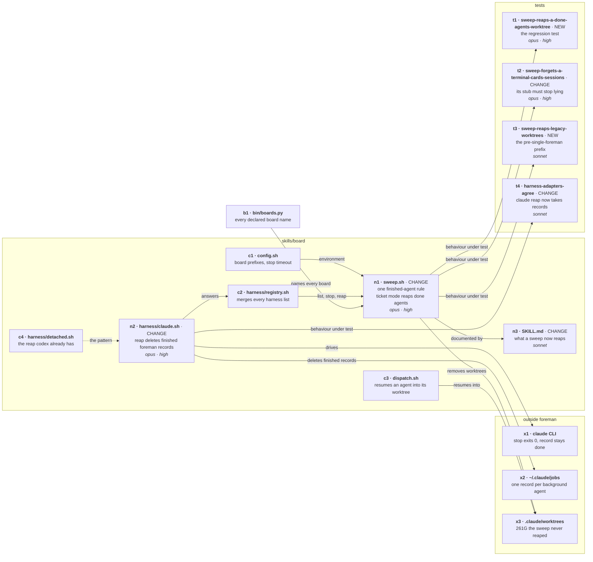

```mermaid
flowchart LR
  subgraph ext["outside foreman"]
    x1["<b>x1 · claude CLI</b><br/>stop exits 0, record stays done"]
    x2["<b>x2 · ~/.claude/jobs</b><br/>one record per background agent"]
    x3["<b>x3 · .claude/worktrees</b><br/>261G the sweep never reaped"]
  end
  b1["<b>b1 · bin/boards.py</b><br/>every declared board name"]
  subgraph board["skills/board"]
    c1["<b>c1 · config.sh</b><br/>board prefixes, stop timeout"]
    c2["<b>c2 · harness/registry.sh</b><br/>merges every harness list"]
    c3["<b>c3 · dispatch.sh</b><br/>resumes an agent into its worktree"]
    c4["<b>c4 · harness/detached.sh</b><br/>the reap codex already has"]
    n1["<b>n1 · sweep.sh</b> · CHANGE<br/>one finished-agent rule<br/>ticket mode reaps done agents<br/><i>opus · high</i>"]
    n2["<b>n2 · harness/claude.sh</b> · CHANGE<br/>reap deletes finished foreman records<br/><i>opus · high</i>"]
    n3["<b>n3 · SKILL.md</b> · CHANGE<br/>what a sweep now reaps<br/><i>sonnet</i>"]
  end
  subgraph tests["tests"]
    t1["<b>t1 · sweep-reaps-a-done-agents-worktree</b> · NEW<br/>the regression test<br/><i>opus · high</i>"]
    t2["<b>t2 · sweep-forgets-a-terminal-cards-sessions</b> · CHANGE<br/>its stub must stop lying<br/><i>opus · high</i>"]
    t3["<b>t3 · sweep-reaps-legacy-worktrees</b> · NEW<br/>the pre-single-foreman prefix<br/><i>sonnet</i>"]
    t4["<b>t4 · harness-adapters-agree</b> · CHANGE<br/>claude reap now takes records<br/><i>sonnet</i>"]
  end

  c1 -->|"environment"| n1
  c2 -->|"list, stop, reap"| n1
  n2 -->|"answers"| c2
  n2 -->|"drives"| x1
  n2 -->|"deletes finished records"| x2
  c4 -.->|"the pattern"| n2
  b1 -->|"names every board"| n1
  n1 -->|"removes worktrees"| x3
  c3 -->|"resumes into"| x3
  n1 -->|"behaviour under test"| t1
  n1 -->|"behaviour under test"| t2
  n1 -->|"behaviour under test"| t3
  n2 -->|"behaviour under test"| t4
  n1 -->|"documented by"| n3
```
