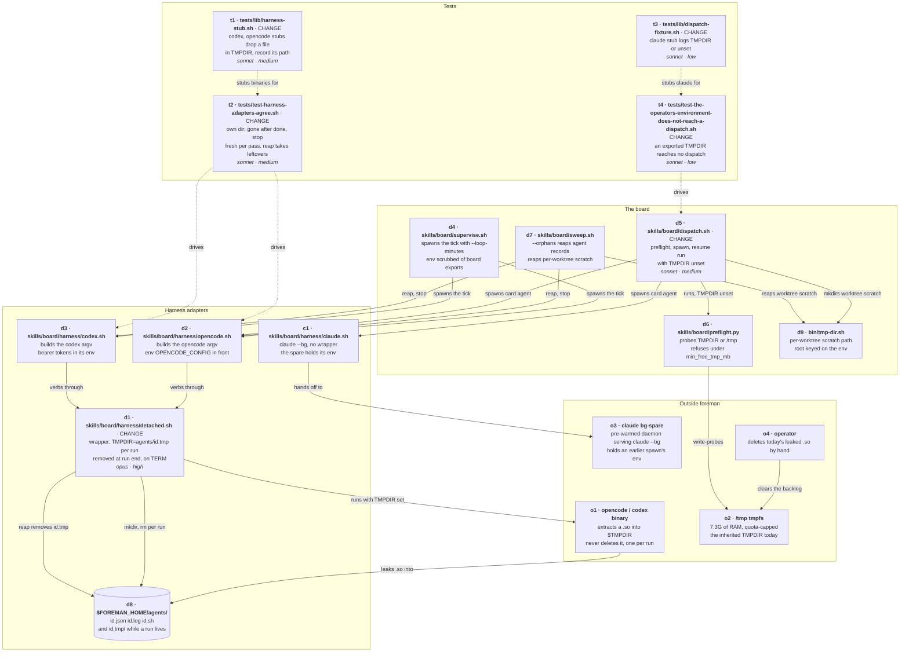

```mermaid
graph TD
  subgraph outside["Outside foreman"]
    o1["<b>o1 · opencode / codex binary</b><br/>extracts a .so into $TMPDIR<br/>never deletes it, one per run"]
    o2["<b>o2 · /tmp tmpfs</b><br/>7.3G of RAM, quota-capped<br/>the inherited TMPDIR today"]
    o3["<b>o3 · claude bg-spare</b><br/>pre-warmed daemon serving claude --bg<br/>holds an earlier spawn's env"]
    o4["<b>o4 · operator</b><br/>deletes today's leaked .so by hand"]
  end
  subgraph harness["Harness adapters"]
    d1["<b>d1 · skills/board/harness/detached.sh</b> · CHANGE<br/>wrapper: TMPDIR=agents/id.tmp per run<br/>removed at run end, on TERM<br/><i>opus · high</i>"]
    d2["<b>d2 · skills/board/harness/opencode.sh</b><br/>builds the opencode argv<br/>env OPENCODE_CONFIG in front"]
    d3["<b>d3 · skills/board/harness/codex.sh</b><br/>builds the codex argv<br/>bearer tokens in its env"]
    c1["<b>c1 · skills/board/harness/claude.sh</b><br/>claude --bg, no wrapper<br/>the spare holds its env"]
    d8[("<b>d8 · $FOREMAN_HOME/agents/</b><br/>id.json id.log id.sh<br/>and id.tmp/ while a run lives")]
  end
  subgraph board["The board"]
    d4["<b>d4 · skills/board/supervise.sh</b><br/>spawns the tick with --loop-minutes<br/>env scrubbed of board exports"]
    d5["<b>d5 · skills/board/dispatch.sh</b> · CHANGE<br/>preflight, spawn, resume run<br/>with TMPDIR unset<br/><i>sonnet · medium</i>"]
    d6["<b>d6 · skills/board/preflight.py</b><br/>probes TMPDIR or /tmp<br/>refuses under min_free_tmp_mb"]
    d7["<b>d7 · skills/board/sweep.sh</b><br/>--orphans reaps agent records<br/>reaps per-worktree scratch"]
    d9["<b>d9 · bin/tmp-dir.sh</b><br/>per-worktree scratch path<br/>root keyed on the env"]
  end
  subgraph tests["Tests"]
    t1["<b>t1 · tests/lib/harness-stub.sh</b> · CHANGE<br/>codex, opencode stubs drop a file<br/>in TMPDIR, record its path<br/><i>sonnet · medium</i>"]
    t2["<b>t2 · tests/test-harness-adapters-agree.sh</b> · CHANGE<br/>own dir; gone after done, stop<br/>fresh per pass, reap takes leftovers<br/><i>sonnet · medium</i>"]
    t3["<b>t3 · tests/lib/dispatch-fixture.sh</b> · CHANGE<br/>claude stub logs TMPDIR or unset<br/><i>sonnet · low</i>"]
    t4["<b>t4 · tests/test-the-operators-environment-does-not-reach-a-dispatch.sh</b><br/>CHANGE<br/>an exported TMPDIR reaches no dispatch<br/><i>sonnet · low</i>"]
  end
  o4 -->|"clears the backlog"| o2
  d4 -->|"spawns the tick"| d2
  d4 -->|"spawns the tick"| d3
  d2 -->|"verbs through"| d1
  d3 -->|"verbs through"| d1
  d1 -->|"runs with TMPDIR set"| o1
  o1 -->|"leaks .so into"| d8
  d1 -->|"mkdir, rm per run"| d8
  d1 -->|"reap removes id.tmp"| d8
  d7 -->|"reap, stop"| d2
  d7 -->|"reap, stop"| d3
  d5 -->|"spawns card agent"| d2
  d5 -->|"spawns card agent"| c1
  c1 -->|"hands off to"| o3
  d5 -->|"runs, TMPDIR unset"| d6
  d6 -->|"write-probes"| o2
  d5 -->|"mkdirs worktree scratch"| d9
  d7 -->|"reaps worktree scratch"| d9
  t1 -.->|"stubs binaries for"| t2
  t2 -.->|"drives"| d2
  t2 -.->|"drives"| d3
  t3 -.->|"stubs claude for"| t4
  t4 -.->|"drives"| d5
```
