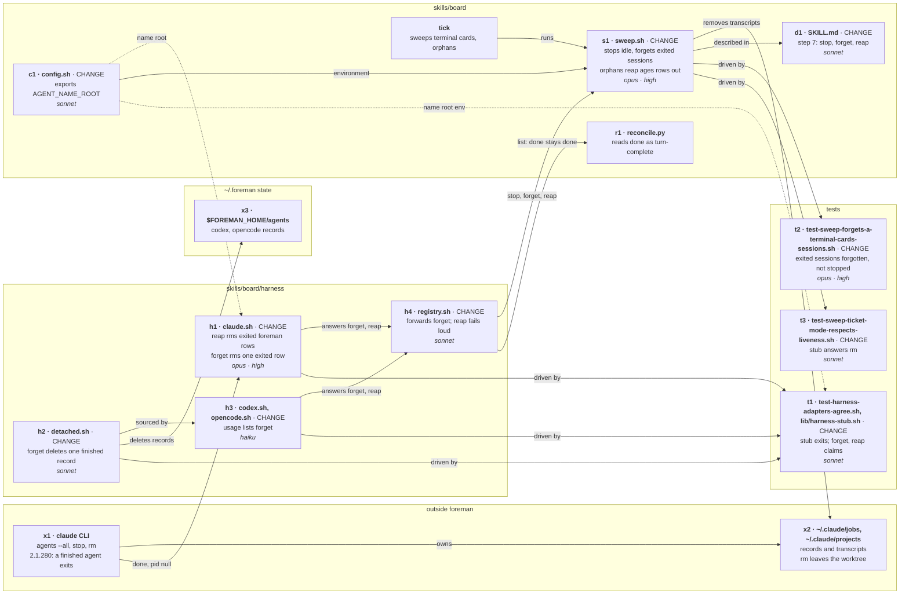

```mermaid
flowchart LR
  subgraph ext["outside foreman"]
    x1["<b>x1 · claude CLI</b><br/>agents --all, stop, rm<br/>2.1.280: a finished agent exits"]
    x2["<b>x2 · ~/.claude/jobs, ~/.claude/projects</b><br/>records and transcripts<br/>rm leaves the worktree"]
  end
  subgraph state["~/.foreman state"]
    x3["<b>x3 · $FOREMAN_HOME/agents</b><br/>codex, opencode records"]
  end
  subgraph harness["skills/board/harness"]
    h1["<b>h1 · claude.sh</b> · CHANGE<br/>reap rms exited foreman rows<br/>forget rms one exited row<br/><i>opus · high</i>"]
    h2["<b>h2 · detached.sh</b> · CHANGE<br/>forget deletes one finished record<br/><i>sonnet</i>"]
    h3["<b>h3 · codex.sh, opencode.sh</b> · CHANGE<br/>usage lists forget<br/><i>haiku</i>"]
    h4["<b>h4 · registry.sh</b> · CHANGE<br/>forwards forget; reap fails loud<br/><i>sonnet</i>"]
  end
  subgraph board["skills/board"]
    c1["<b>c1 · config.sh</b> · CHANGE<br/>exports AGENT_NAME_ROOT<br/><i>sonnet</i>"]
    s1["<b>s1 · sweep.sh</b> · CHANGE<br/>stops idle, forgets exited sessions<br/>orphans reap ages rows out<br/><i>opus · high</i>"]
    r1["<b>r1 · reconcile.py</b><br/>reads done as turn-complete"]
    tick["<b>tick</b><br/>sweeps terminal cards, orphans"]
    d1["<b>d1 · SKILL.md</b> · CHANGE<br/>step 7: stop, forget, reap<br/><i>sonnet</i>"]
  end
  subgraph tests["tests"]
    t1["<b>t1 · test-harness-adapters-agree.sh, lib/harness-stub.sh</b> · CHANGE<br/>stub exits; forget, reap claims<br/><i>sonnet</i>"]
    t2["<b>t2 · test-sweep-forgets-a-terminal-cards-sessions.sh</b> · CHANGE<br/>exited sessions forgotten, not stopped<br/><i>opus · high</i>"]
    t3["<b>t3 · test-sweep-ticket-mode-respects-liveness.sh</b> · CHANGE<br/>stub answers rm<br/><i>sonnet</i>"]
  end

  x1 -->|"owns"| x2
  x1 -->|"done, pid null"| h1
  c1 -.->|"name root"| h1
  c1 -->|"environment"| s1
  h2 -->|"sourced by"| h3
  h2 -->|"deletes records"| x3
  h1 -->|"answers forget, reap"| h4
  h3 -->|"answers forget, reap"| h4
  h4 -->|"stop, forget, reap"| s1
  h4 -->|"list: done stays done"| r1
  tick -->|"runs"| s1
  s1 -->|"removes transcripts"| x2
  s1 -->|"described in"| d1
  h1 -->|"driven by"| t1
  h2 -->|"driven by"| t1
  h3 -->|"driven by"| t1
  c1 -.->|"name root env"| t1
  s1 -->|"driven by"| t2
  s1 -->|"driven by"| t3
```
