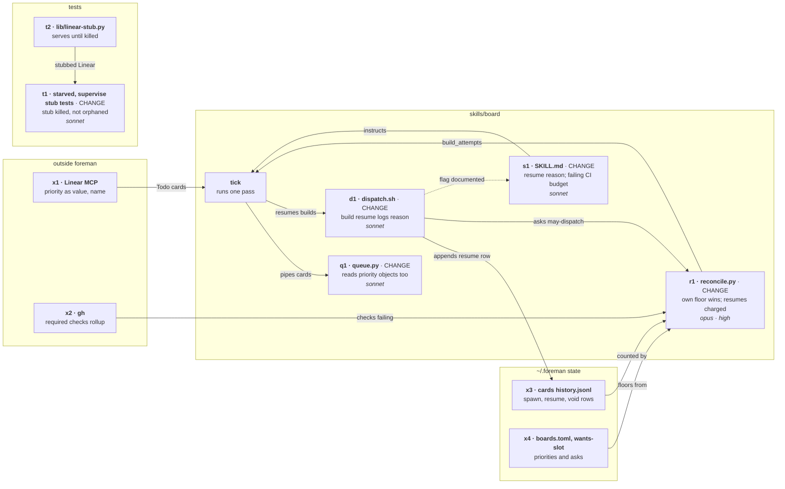

```mermaid
flowchart LR
  subgraph ext["outside foreman"]
    x1["<b>x1 · Linear MCP</b><br/>priority as value, name"]
    x2["<b>x2 · gh</b><br/>required checks rollup"]
  end
  subgraph state["~/.foreman state"]
    x3["<b>x3 · cards history.jsonl</b><br/>spawn, resume, void rows"]
    x4["<b>x4 · boards.toml, wants-slot</b><br/>priorities and asks"]
  end
  subgraph board["skills/board"]
    q1["<b>q1 · queue.py</b> · CHANGE<br/>reads priority objects too<br/><i>sonnet</i>"]
    d1["<b>d1 · dispatch.sh</b> · CHANGE<br/>build resume logs reason<br/><i>sonnet</i>"]
    r1["<b>r1 · reconcile.py</b> · CHANGE<br/>own floor wins; resumes charged<br/><i>opus · high</i>"]
    s1["<b>s1 · SKILL.md</b> · CHANGE<br/>resume reason; failing CI budget<br/><i>sonnet</i>"]
    tick["<b>tick</b><br/>runs one pass"]
  end
  subgraph tests["tests"]
    t1["<b>t1 · starved, supervise stub tests</b> · CHANGE<br/>stub killed, not orphaned<br/><i>sonnet</i>"]
    t2["<b>t2 · lib/linear-stub.py</b><br/>serves until killed"]
  end

  x1 -->|"Todo cards"| tick
  tick -->|"pipes cards"| q1
  tick -->|"resumes builds"| d1
  d1 -->|"appends resume row"| x3
  d1 -->|"asks may-dispatch"| r1
  x3 -->|"counted by"| r1
  x4 -->|"floors from"| r1
  x2 -->|"checks failing"| r1
  r1 -->|"build_attempts"| tick
  s1 -->|"instructs"| tick
  d1 -.->|"flag documented"| s1
  t2 -->|"stubbed Linear"| t1
```
