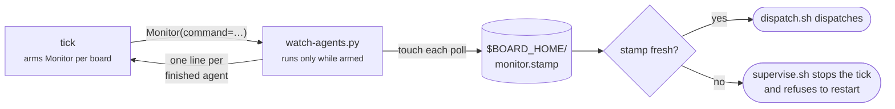

# An edge-trigger that cannot fail silently

## Goal

A board whose agent Monitor is not armed must stop foreman, not slow it down.

Today an unarmed Monitor costs up to one `TICK_INTERVAL_MINUTES` of dead air on
every finished agent, and says nothing. The board keeps merging cards, so every
surface reads healthy. Only the clock disagrees.

## The incident

Measured 2026-09-22, over the five cards this board has built on its own
repository. Times are from Linear's `startedAt` and `completedAt`, and from
`gh` for the commits and merges.

| Segment | Range observed |
| --- | --- |
| dispatch → first commit | 38m – 33h |
| commit → pull request open | 15s – 1h 09m |
| pull request open → merged | 7m – 7h 41m |

Hand-driven pull requests on the same repository, in the same window, merge
about five minutes after they open. The work is not slow. The loop around it
is.

**These cards measure the cost of no edge-trigger, not a broken Monitor.** They
were built by an installation on a harness that arms nothing, where `SKILL.md`
says to arm nothing and names the price: up to one interval of latency on a
finished agent. The measurements are what that price is worth in hours.

The Monitor is what buys the price back on the harness that has one. This spec
is about the fact that it can stop doing so without telling anyone. One card's
long review has a separate known cause, the rate-limit stall that a later card
fixed.

## What is wrong now

**1. The documented Monitor call is bound to one harness version.**

`skills/board/SKILL.md` tells the tick to call:

```
Monitor(command="FOREMAN_INSTANCE=<board> ~/.foreman/install/skills/board/watch-agents.py",
        persistent=True, description="board agents finishing: <board>")
```

That call is correct on Claude Code 2.1.228, whose `sdk-tools.d.ts` declares
`persistent: boolean` as required and documents it as "Run for the lifetime of
the session (no timeout)."

It is rejected on 2.1.275. That version removes `persistent`, sets
`additionalProperties: false`, requires `timeout_ms`, and caps every monitor at
30 minutes with re-arming left to the caller.

No single call works on both. foreman self-updates and the harness updates
itself, so the version boundary is a date, not a hypothesis.

**2. Nothing witnesses the arming.**

The only `Monitor(` in this repository outside `SKILL.md` is the docstring at
`skills/board/watch-agents.py:8`. No script arms the Monitor. It exists only
when the tick reads the prose and calls the tool, once per board, every tick.
`TICK_MAX_AGE_HOURS` recycles the tick every 12 hours, so each replacement
session arms from scratch.

**3. Nothing tests it.**

`grep -rln Monitor tests/` returns one file,
`tests/test-watch-agents-dispatched-regex.sh`, and its only mention of Monitor
is a comment. That test covers what `watch-agents.py` emits. Nothing covers
whether anything armed it. A tick that arms nothing passes the whole suite.

**4. The failure is invisible.**

`SKILL.md` calls the heartbeat a backstop, so a board with no Monitor still
works. It dispatches, reviews and merges. It is slower by one interval per
finished agent, and no surface reports the difference. This is the same shape
as the constraint `AGENTS.md` already states about a check that never reports:
waiting looks exactly like running, so nothing says so.

## The model

Three roles, and no role covers for another.

- **The prose arms.** `SKILL.md` instructs the tick to call `Monitor`.
- **A script witnesses.** `watch-agents.py` stamps a file while it runs.
- **A script stops.** `dispatch.sh` and `supervise.sh` refuse on a stale stamp.



The tick cannot be the witness. An LLM asked to report that a call succeeded
reports intent, not liveness: a tick whose `Monitor` call was rejected by a
newer harness would report armed just as readily. `config.sh` already names
this failure class, about a host slot releasable only by an LLM remembering one
line.

The harness cannot be the witness either. A Monitor lives inside the session
and dies with it, as `SKILL.md` says. Nothing persists it: there is no monitor
state under `$HOME/.claude`.

That leaves the Monitor's own command. `watch-agents.py` runs only while a
Monitor is alive. Its execution is the fact worth recording.

## The stamp

`watch-agents.py` writes `$BOARD_HOME/monitor.stamp` on every poll, before it
reads the agent registry. The file holds one ISO-8601 UTC timestamp. Its
mtime is what readers use; the contents are for a human reading the file.

It stamps on every poll, not once at startup. A stamp written once proves a
process started. A stamp refreshed every `WATCH_POLL_SECONDS` proves the
edge-trigger is alive now, which is the question every reader is asking.

It stamps before the first emit, during the silent seeding poll the docstring
describes. Seeding is a poll like any other, and a board whose Monitor is
armed but has seen no transitions yet must not read as unarmed.

**Freshness is derived, not stated.** `MONITOR_STALE_SECONDS` defaults to
`WATCH_POLL_SECONDS * 4`, which is 60 with the default poll of 15. Derived for
the reason `DEMAND_STALE_MINUTES` derives from `TICK_INTERVAL_MINUTES`: an
operator who slows the poll widens the window with it, instead of silently
breaking every gate. Four polls tolerates one slow registry read and one
missed poll without calling a live Monitor dead.

**A grace period covers the top of a tick, and only the supervisor needs it.**
Nothing is armed in the first seconds of a fresh tick, by definition. So
`supervise.sh` acts on a stale stamp only once the tick has been running longer
than `MONITOR_GRACE_SECONDS`, default 120 — long enough to read the inbox, list
the boards and arm one Monitor each, and far shorter than a tick's budget. It
reads the tick's age from the agent registry, where its watchdog already reads
it.

`dispatch.sh` needs no grace and gets none. It has no way to read when the tick
started, and no reason to: arming happens at the top of a tick and dispatch
happens later in the same pass, so a stamp is already fresh by the time
`dispatch.sh` runs. A missing stamp at dispatch time is the fault, not a
race.

## The gates

Fail-stop is machine-wide, and it is enforced by scripts. It cannot live in
`SKILL.md`. A tick asked in prose to exit when a tool call fails may carry on
instead, which is the failure this spec exists to remove.

**`dispatch.sh` refuses.** A new gate beside the existing slot gates, in the
same voice: a stale stamp on any board means no dispatch on any board. This is
the gate that stops work reaching agents.

**`supervise.sh` stops the tick and refuses to restart it.** The watchdog
already stops a tick that has been silent past `TICK_STALL_MINUTES` and one
that is idle past `TICK_DEAD_MINUTES`. A stale stamp joins them, with one
difference that matters: the other two restart, this one does not. A tick
restarted against a harness that rejects the call would arm nothing again and
loop. The supervisor stops, logs the reason, and leaves the machine stopped.

**The dashboard says which board and why.** `bin/dashboard.py` shows per-board
monitor state and the age of each stamp, so an operator reading the page sees
the stopped machine and its cause together.

Machine-wide, not per-board, because a rejected `Monitor` call is evidence
about the harness contract, and every board on the machine shares one harness.

## What this costs

One false positive stops every board.

That is the deliberate trade. The bound on it is the derived staleness window,
the grace period, and the fact that the stamp is written by a loop that has no
other work to do. A `watch-agents.py` too busy to touch a file every 60 seconds
is not healthy either.

The failure this accepts is a stopped machine an operator must restart. The
failure it removes is a machine that looks healthy and runs at heartbeat speed
for as long as nobody measures it. The table above prices that failure in
hours per card.

## The arming contract

`SKILL.md` gains the call that works on the harness foreman targets, and the
version split as a named hazard rather than a silent one:

- The call, with `timeout_ms` supplied. `sdk-tools.d.ts` declares it required
  on both versions, and the current snippet omits it.
- Re-arming. On a harness that caps monitors, an armed Monitor expires. The
  tick re-arms at the top of every tick, which it must do anyway after a
  recycle.
- The version note: which harness versions accept which argument, so the next
  shift is read as a known hazard.

`watch-agents.py`'s docstring carries the same correction. It is where the next
reader looks.

## Testing

Tests drive the real scripts and stub at the external boundary, as
`tests/lib/linear-stub.py` does.

- `watch-agents.py` writes the stamp on its first poll, before any emit.
- `watch-agents.py` refreshes the stamp on a poll that emits nothing.
- `dispatch.sh` refuses when a stamp is stale past `MONITOR_STALE_SECONDS`.
- `dispatch.sh` dispatches when the stamp is fresh.
- `dispatch.sh` refuses when no stamp exists at all.
- `supervise.sh` stops the tick on a stale stamp and does not restart it.
- `supervise.sh` leaves a tick alone inside `MONITOR_GRACE_SECONDS` of its
  start.
- `MONITOR_STALE_SECONDS` follows `WATCH_POLL_SECONDS` when an operator
  overrides the poll.
- The `Monitor` call in `SKILL.md` names `timeout_ms`. This is the assertion
  that would have caught the present bug, and the reason the suite passed over
  it.

## Deferred

- **Spanning harness versions automatically.** No try-and-fall-back, no version
  detection. The gate makes a rejected call loud, and an operator corrects the
  documented call. An automatic fallback is an abstraction with no second
  caller yet.
- **Restarting on a stale stamp.** Rejected above: a restart loop against a
  broken contract turns a slow machine into a thrashing one.
- **Per-stage latency reporting.** Worth doing, and separate. Nothing in
  foreman records how long a card spends in each stage, which is why the
  incident above had to be reconstructed from Linear and `gh`.
